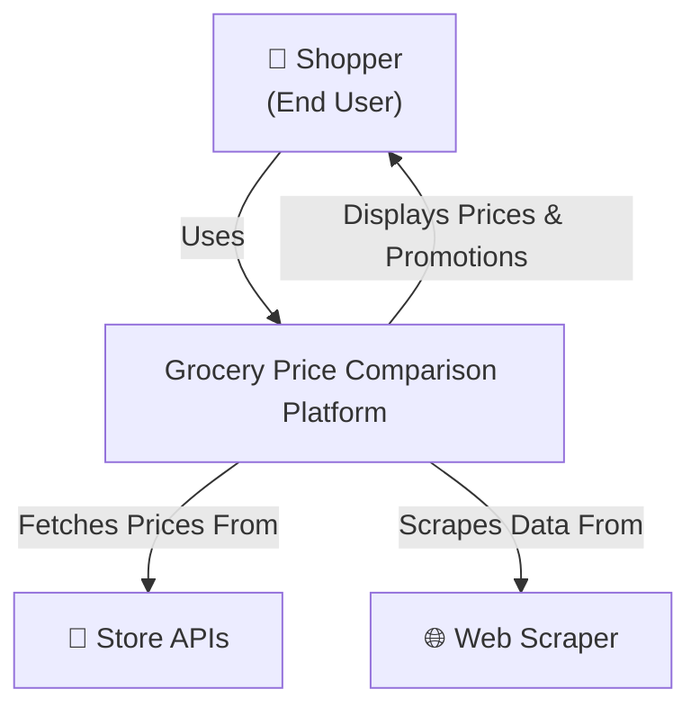
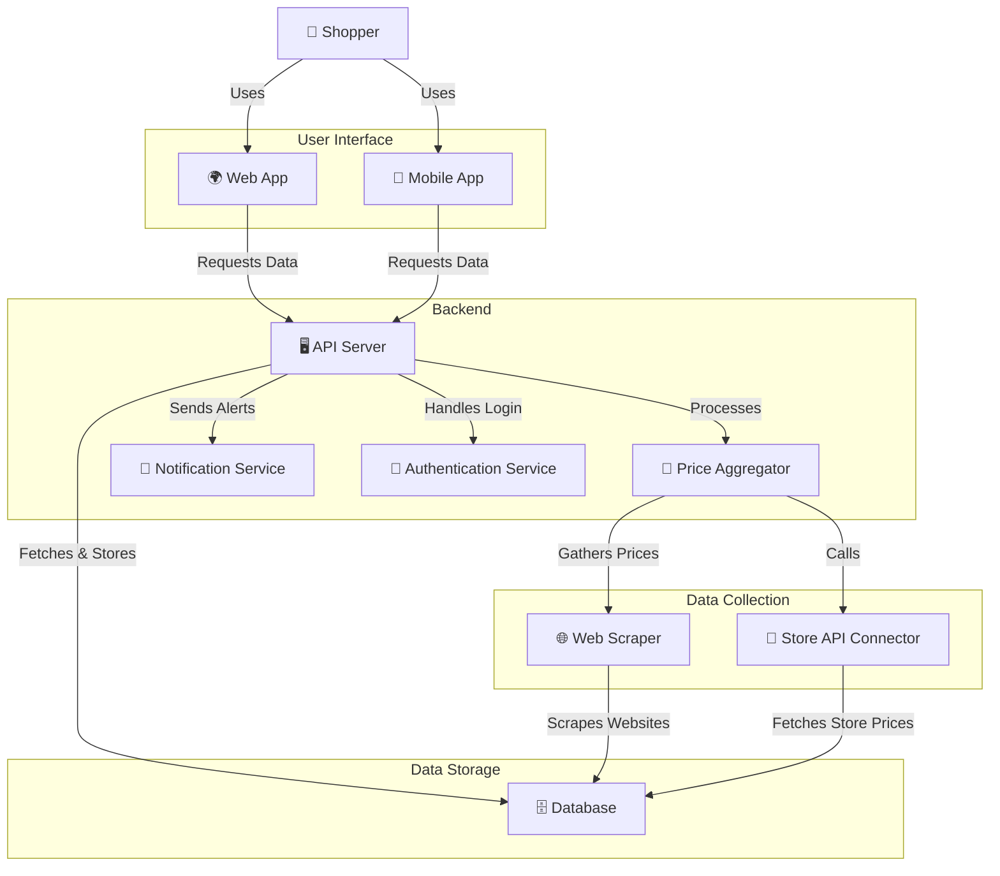

# C4 Architectural Diagrams

* **Context (Level 1)** – High-level system overview and interactions with users/external systems.
* **Container (Level 2)** – Breakdown of the system into main components.
* **Component (Level 3)** – Internal structure of each container.
* **Code (Level 4)** – Low-level details.

**Level 1**


**Level 2**


**Level 4**
```mermaid
# Grocery Price Comparison - C4 Component Diagram

```mermaid
graph TD;
    subgraph User Interface
        WebApp["🌍 Web App"]
        MobileApp["📱 Mobile App"]
    end

    subgraph Backend
        API["🖥️ API Server"]
        Aggregator["🔄 Price Aggregator"]
        Notification["📢 Notification Service"]
        Auth["🔑 Authentication Service"]
    end

    subgraph Data Storage
        Database["🗄️ Database"]
        Logs["📜 Logging System"]
    end

    subgraph Data Collection
        Scraper["🌐 Web Scraper"]
        StoreAPI["🏪 Store API Connector"]
        ManualEntry["✍️ Manual Data Entry"]
    end

    % Connections
    User["🛒 Shopper"] -->|Uses| WebApp
    User -->|Uses| MobileApp

    WebApp -->|Requests Data| API
    MobileApp -->|Requests Data| API

    API -->|Fetches Prices| Aggregator
    Aggregator -->|Uses| Scraper
    Aggregator -->|Calls| StoreAPI
    Aggregator -->|Processes Data| Database
    API -->|Sends Notifications| Notification
    API -->|Authenticates Users| Auth
    Scraper -->|Extracts Data| Database
    StoreAPI -->|Fetches Store Data| Database
    ManualEntry -->|Uploads Data| Database
```