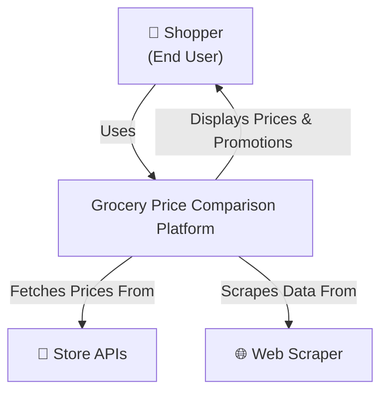
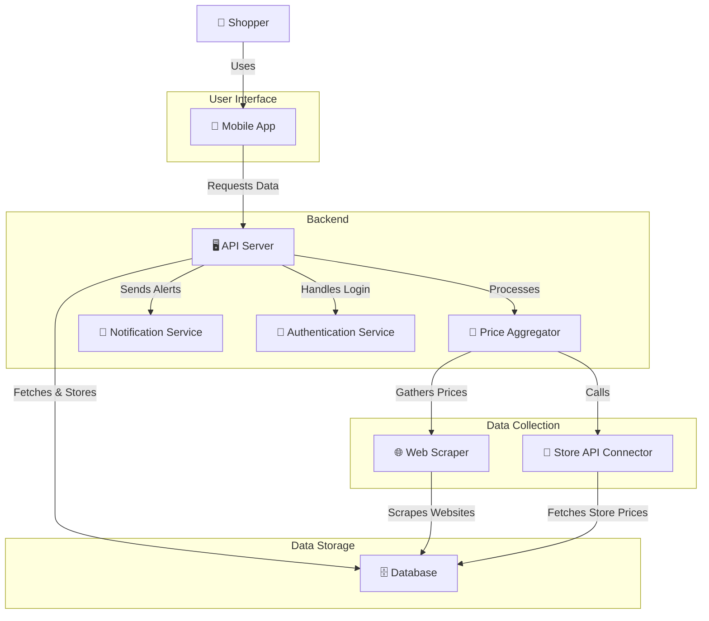
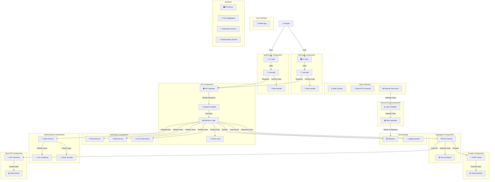
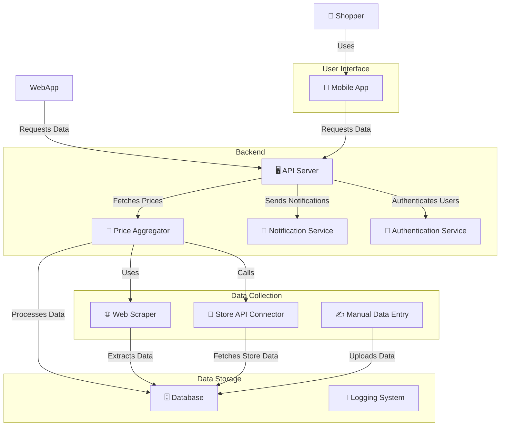

# C4 Architectural Diagrams

* **Context (Level 1)** – High-level system overview and interactions with users/external systems.
* **Container (Level 2)** – Breakdown of the system into main components.
* **Component (Level 3)** – Internal structure of each container.
* **Code (Level 4)** – Low-level details.

**Level 1**

**Level 2**

**Level 3**

**Level 4**
