# C4 Architectural Diagrams

* **Context (Level 1)** – High-level system overview and interactions with users/external systems.
* **Container (Level 2)** – Breakdown of the system into main components.
* **Component (Level 3)** – Internal structure of each container.
* **Code (Level 4)** – Low-level details.

### **Level 1**

```mermaid
graph TD;
    User["🛒 Shopper\n(End User)"] -->|Uses| System["Grocery Price Comparison Platform"]
    System -->|Fetches Prices From| StoreAPIs["🏪 Store APIs"]
    System -->|Scrapes Data From| WebScraper["🌐 Web Scraper"]
    System -->|Displays Prices & Promotions| User
```

### **Level 2**

```mermaid
graph TD;
    subgraph User Interface
        MobileApp["📱 Mobile App"]
    end

    subgraph Backend
        API["🖥️ API Server"]
        Aggregator["🔄 Price Aggregator"]
        Notification["📢 Notification Service"]
        Auth["🔑 Authentication Service"]
    end

    subgraph Data Storage
        Database["🗄️ Database"]
    end

    subgraph Data Collection
        Scraper["🌐 Web Scraper"]
        StoreAPI["🏪 Store API Connector"]
    end

    User["🛒 Shopper"] -->|Uses| MobileApp

    MobileApp -->|Requests Data| API

    API -->|Fetches & Stores| Database
    API -->|Processes| Aggregator
    API -->|Sends Alerts| Notification
    API -->|Handles Login| Auth

    Aggregator -->|Gathers Prices| Scraper
    Aggregator -->|Calls| StoreAPI
    Scraper -->|Scrapes Websites| Database
    StoreAPI -->|Fetches Store Prices| Database
```

### **Level 3**

```mermaid
graph TD;
    subgraph User Interface
        MobileApp["📱 Mobile App"]
    end

    subgraph Backend
        API["🖥️ API Server"]
        Aggregator["🔄 Price Aggregator"]
        Notification["📢 Notification Service"]
        Auth["🔑 Authentication Service"]
    end

    subgraph Data Storage
        Database["🗄️ Database"]
        Logs["📜 Logging System"]
    end

    subgraph Data Collection
        Scraper["🌐 Web Scraper"]
        StoreAPI["🏪 Store API Connector"]
        ManualEntry["✍️ Manual Data Entry"]
    end


    subgraph Mobile App Components
        UI_Mobile["📱 UI Layer"]
        Controller_Mobile["🔄 Controller"]
        DataHandler_Mobile["💾 Data Handler"]
    end

    subgraph API Components
        API_Gateway["🌍 API Gateway"]
        RequestHandler["🔄 Request Handler"]
        BusinessLogic["📊 Business Logic"]
        Cache["⚡ Cache Layer"]
    end

    subgraph Aggregator Components
        PriceFetcher["🔍 Price Fetcher"]
        PriceAnalyzer["📊 Price Analyzer"]
    end

    subgraph Notification Components
        EmailService["📧 Email Service"]
        SMSService["📩 SMS Service"]
        PushService["📲 Push Notifications"]
    end

    subgraph Authentication Components
        AuthDB["🔑 User Database"]
        TokenService["🔐 Token Service"]
        OAuth["🔗 OAuth Provider"]
    end

    subgraph Scraper Components
        HTMLParser["📄 HTML Parser"]
        DataExtractor["📊 Data Extractor"]
    end

    subgraph Store API Components
        APIConnector["🔗 API Connector"]
        DataParser["📊 Data Parser"]
    end

    subgraph Manual Entry Components
        InputValidator["✔️ Input Validator"]
        DataUploader["📤 Data Uploader"]
    end

 
    User["🛒 Shopper"] -->|Uses| UI
    User -->|Uses| UI_Mobile

    UI -->|Calls| Controller
    Controller -->|Fetches Data| DataHandler
    UI_Mobile -->|Calls| Controller_Mobile
    Controller_Mobile -->|Fetches Data| DataHandler_Mobile

    Controller -->|Requests| API_Gateway
    Controller_Mobile -->|Requests| API_Gateway
    API_Gateway -->|Routes Requests| RequestHandler
    RequestHandler -->|Executes| BusinessLogic
    BusinessLogic -->|Queries| Database
    BusinessLogic -->|Caches Data| Cache

    BusinessLogic -->|Requests Prices| PriceFetcher
    PriceFetcher -->|Analyzes Data| PriceAnalyzer

    BusinessLogic -->|Notifies Users| EmailService
    BusinessLogic -->|Notifies Users| SMSService
    BusinessLogic -->|Notifies Users| PushService

    BusinessLogic -->|Authenticates| TokenService
    TokenService -->|Verifies Users| AuthDB
    TokenService -->|OAuth Login| OAuth

    PriceFetcher -->|Scrapes| HTMLParser
    HTMLParser -->|Extracts Data| DataExtractor

    PriceFetcher -->|Calls API| APIConnector
    APIConnector -->|Parses Data| DataParser

    ManualEntry -->|Validates Input| InputValidator
    InputValidator -->|Uploads Data| DataUploader
    DataUploader -->|Stores in Database| Database

    BusinessLogic -->|Logs Events| Logs

```

### **Level 4**

```mermaid
graph TD;
    subgraph User Interface
        MobileApp["📱 Mobile App"]
    end

    subgraph Backend
        API["🖥️ API Server"]
        Aggregator["🔄 Price Aggregator"]
        Notification["📢 Notification Service"]
        Auth["🔑 Authentication Service"]
    end

    subgraph Data Storage
        Database["🗄️ Database"]
        Logs["📜 Logging System"]
    end

    subgraph Data Collection
        Scraper["🌐 Web Scraper"]
        StoreAPI["🏪 Store API Connector"]
        ManualEntry["✍️ Manual Data Entry"]
    end

   
    User["🛒 Shopper"] -->|Uses| MobileApp

    WebApp -->|Requests Data| API
    MobileApp -->|Requests Data| API

    API -->|Fetches Prices| Aggregator
    Aggregator -->|Uses| Scraper
    Aggregator -->|Calls| StoreAPI
    Aggregator -->|Processes Data| Database
    API -->|Sends Notifications| Notification
    API -->|Authenticates Users| Auth
    Scraper -->|Extracts Data| Database
    StoreAPI -->|Fetches Store Data| Database
    ManualEntry -->|Uploads Data| Database
```

```mermaid
graph TD;
  %% Define Actors
  User["🧑‍💻 User"] 
  Retailer["🏪 Retailer"]
  Admin["🛠️ Admin"]
  DataProvider["🔗 Data Provider"]
  Advertiser["📢 Advertiser"]
  System["🤖 System"]

  %% Define Use Cases
  A["🔍 Search for Products"]
  B["📊 Compare Prices"]
  C["📍 View Nearby Deals"]
  D["📢 Receive Price Alerts"]
  E["💾 Save/Share Items"]
  F["📦 Manage Inventory"]
  G["📡 Provide Data via API"]
  H["📈 Advertise Promotions"]
  I["🔧 Manage System Settings"]

  %% Relationships
  User --> A
  User --> B
  User --> C
  User --> D
  User --> E

  Retailer --> F
  Retailer --> H

  Admin --> I

  DataProvider --> G

  Advertiser --> H

  System --> A
  System --> B
  System --> C
  System --> D
```

