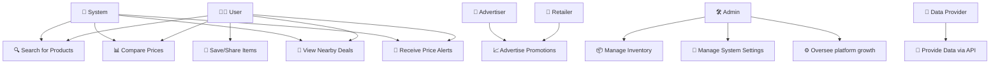

```mermaid
graph TD;
  %% Define Actors
  User["🧑‍💻 User"] 
  Retailer["🏪 Retailer"]
  Admin["🛠️ Admin"]
  DataProvider["🔗 Data Provider"]
  Advertiser["📢 Advertiser"]
  System["🤖 System"]

  %% Define Use Cases
  A["🔍 Search for Products"]
  B["📊 Compare Prices"]
  C["📍 View Nearby Deals"]
  D["📢 Receive Price Alerts"]
  E["💾 Save/Share Items"]
  F["📦 Manage Inventory"]
  G["📡 Provide Data via API"]
  H["📈 Advertise Promotions"]
  I["🔧 Manage System Settings"]
  J["⚙️ Oversee platform growth"]

  %% Relationships
  User --> A
  User --> B
  User --> C
  User --> D
  User --> E

  Retailer --> H

  Admin --> F
  Admin --> I
  Admin --> J

  DataProvider --> G

  Advertiser --> H

  System --> A
  System --> B
  System --> C
  System --> D
```
