```mermaid
graph TD;
  %% Define Actors
  User["🧑‍💻 User"] 
  Retailer["🏪 Retailer"]
  Admin["🛠️ Admin"]
  DataProvider["🔗 Data Provider"]
  Advertiser["📢 Advertiser"]
  System["🤖 System"]

  %% Define Use Cases
  A["🔍 Search for Products"]
  B["📊 Compare Prices"]
  C["📍 View Nearby Deals"]
  D["📢 Receive Price Alerts"]
  E["💾 Save/Share Items"]
  F["📦 Manage Inventory"]
  G["📡 Provide Data via API"]
  H["📈 Advertise Promotions"]
  I["🔧 Manage System Settings"]
  J["⚙️ Oversee platform growth"]

  %% Relationships
  User --> A
  User --> B
  User --> C
  User --> D
  User --> E

  Retailer --> H

  Admin --> F
  Admin --> I
  Admin --> J

  DataProvider --> G

  Advertiser --> H

  System --> A
  System --> B
  System --> C
  System --> D
```

## 📌 Written Explanation
### 1️⃣ Key Actors and Their Roles
* User 🧑‍💻 → Search for products, compare prices, view nearby deals, receive price alerts and save/share items.
* Retailer 🏪 → Promotes deals.
* Admin 🛠️ → Manages inventory, manages system settings and oversees platform operations.
* Data Provider 🔗 → Supplies pricing and product data via APIs or other sources.
* Advertiser 📢 → Uses the platform to promote products and discounts.
* System 🤖 → Processes requests, retrieves data, and handles notifications.

### 2️⃣ Relationships Between Actors and Use Cases
* **Users** interact with core features such as searching, comparing, and tracking prices.
* **Retailers** provide promotional data.
* **Admins** Manage inventory andoversee the system, ensuring smooth operation and security.
* **Data Providers** integrate APIs to fetch accurate pricing information.
* **Advertisers** contribute promotional content, supporting business goals.
* **The system **automates processes like fetching data and triggering notifications.

### 3️⃣ Addressing Stakeholder Concerns
* Users benefit from comprehensive search and price tracking features, ensuring they make informed shopping decisions.
* Retailers & Advertisers gain visibility for their products through promotions.
* Data Providers ensure accuracy by integrating APIs to provide up-to-date pricing.
* Admins oversee system performance and security, addressing concerns about reliability and maintenance.

# Use Case Diagram
This use case outlines the implementation of a an agile pipeline for a price comparrison app that aggregates information for users.

## Objectives
The objective of this Use Case Diagram is to visually represent the interactions between key actors and the grocery price comparison system. It illustrates how stakeholders interact with the system to perform various functions.

## Stakeholders
* User
* Retailer
* Admin
* DataProvider
* Advertiser
* System

### **Functional Requirements**
| | **Requirement** | **Description** | **Acceptance Criteria** |
|-|---------------|----------------|--------------------------|
| 01 | **Search Functionality** | Users can search for specific items across multiple stores. | Users can enter a product name, and relevant results from various retailers are displayed. |
| 02 | **Comparison Engine** | The system displays price differences across multiple retailers. | Users can view and compare item prices from at least three different stores. |
| 03 | **Filter Options** | Users can filter results by price, location, or retailer. | Users can apply filters to refine search results based on selected criteria. |
| 04 | **Geolocation Integration** | Suggest deals available nearby or within a specific radius. | Users can enable location services and view deals relevant to their area. |
| 05 | **Daily Specials** | Highlight discounted items or promotions from stores. | The system fetches and displays daily deals from participating retailers. |
| 06 | **Notifications** | Send alerts for new deals or when prices drop for a user’s favorite items. | Users can opt in for notifications and receive alerts for price changes. |
| 07 | **Save & Share** | Users can save shopping lists or share deals via text applications. | Users can save items to a personal list and share them via messaging apps or email. |
| 08 | **Retailer Inventory Management** | Retailers can update available stock and pricing. | Retailers have access to an interface to modify product details and stock availability. |
| 09 | **User Account Management** | Users can create, update, and delete their accounts. | Users can register, log in, update personal details, and delete their accounts. |
| 10 | **Data Integration (APIs & Scraping)** | The system collects price data via APIs or web scraping. | The system fetches pricing data from at least two external sources automatically. |
| 11 | **Advertisement Management** | Advertisers can promote products within the system. | Advertisers can create and manage promotions visible to users. |
| 12 | **Admin Panel** | Administrators can manage system settings, users, and retailer permissions. | Admins have access to manage user roles, monitor system activity, and enforce policies. |

