```mermaid
graph TD;
  %% Define Actors
  User["🧑‍💻 User"] 
  Retailer["üè™ Retailer"]
  Admin["🛠️ Admin"]
  DataProvider["üîó Data Provider"]
  Advertiser["📢 Advertiser"]
  System["🤖 System"]

  %% Define Use Cases
  A["üîç Search for Products"]
  B["üìä Compare Prices"]
  C["üìç View Nearby Deals"]
  D["📢 Receive Price Alerts"]
  E["üíæ Save/Share Items"]
  F["📦 Manage Inventory"]
  G["üì° Provide Data via API"]
  H["üìà Advertise Promotions"]
  I["üîß Manage System Settings"]
  J["⚙️ Oversee platform growth"]

  %% Relationships
  User --> A
  User --> B
  User --> C
  User --> D
  User --> E

  Retailer --> H

  Admin --> F
  Admin --> I
  Admin --> J

  DataProvider --> G

  Advertiser --> H

  System --> A
  System --> B
  System --> C
  System --> D
```

## 📌 Written Explanation
### 1️⃣ Key Actors and Their Roles
* User 🧑‍💻 → Search for products, compare prices, view nearby deals, receive price alerts and save/share items.
* Retailer 🏪 → Promotes deals.
* Admin 🛠️ → Manages inventory, manages system settings and oversees platform operations.
* Data Provider 🔗 → Supplies pricing and product data via APIs or other sources.
* Advertiser 📢 → Uses the platform to promote products and discounts.
* System 🤖 → Processes requests, retrieves data, and handles notifications.

### 2️⃣ Relationships Between Actors and Use Cases
* **Users** interact with core features such as searching, comparing, and tracking prices.
* **Retailers** provide promotional data.
* **Admins** Manage inventory andoversee the system, ensuring smooth operation and security.
* **Data Providers** integrate APIs to fetch accurate pricing information.
* **Advertisers** contribute promotional content, supporting business goals.
* **The system **automates processes like fetching data and triggering notifications.

### 3️⃣ Addressing Stakeholder Concerns
* Users benefit from comprehensive search and price tracking features, ensuring they make informed shopping decisions.
* Retailers & Advertisers gain visibility for their products through promotions.
* Data Providers ensure accuracy by integrating APIs to provide up-to-date pricing.
* Admins oversee system performance and security, addressing concerns about reliability and maintenance.

# Use Case Diagram
This use case outlines the implementation of a an agile pipeline for a price comparrison app that aggregates information for users.

## Objectives
The objective of this Use Case Diagram is to visually represent the interactions between key actors and the grocery price comparison system. It illustrates how stakeholders interact with the system to perform various functions.

## Stakeholders
* User
* Retailer
* Admin
* DataProvider
* Advertiser
* System

## Requirements
#### **Functional Requirements**
| | Requirement | Description | Acceptance Criteria |
|-|---------------|----------------|--------------------------|
| 01 | Search Functionality | Users can search for specific items across multiple stores. | Users can enter a product name, and relevant results from various retailers are displayed. |
| 02 | Comparison Engine | The system displays price differences across multiple retailers. | Users can view and compare item prices from at least three different stores. |
| 03 | Filter Options | Users can filter results by price, location, or retailer. | Users can apply filters to refine search results based on selected criteria. |
| 04 | Geolocation Integration | Suggest deals available nearby or within a specific radius. | Users can enable location services and view deals relevant to their area. |
| 05 | Daily Specials | Highlight discounted items or promotions from stores. | The system fetches and displays daily deals from participating retailers. |
| 06 | Notifications | Send alerts for new deals or when prices drop for a user’s favorite items. | Users can opt in for notifications and receive alerts for price changes. |
| 07 | Save & Share | Users can save shopping lists or share deals via text applications. | Users can save items to a personal list and share them via messaging apps or email. |
| 08 | Retailer Inventory Management | Retailers can update available stock and pricing. | Retailers have access to an interface to modify product details and stock availability. |
| 09 | User Account Management | Users can create, update, and delete their accounts. | Users can register, log in, update personal details, and delete their accounts. |
| 10 | Data Integration (APIs & Scraping) | The system collects price data via APIs or web scraping. | The system fetches pricing data from at least two external sources automatically. |
| 11 | Advertisement Management | Advertisers can promote products within the system. | Advertisers can create and manage promotions visible to users. |
| 12 | Admin Panel | Administrators can manage system settings, users, and retailer permissions. | Admins have access to manage user roles, monitor system activity, and enforce policies. |

#### Non-Functional Requirements  

| Requirement Category | Requirement | Acceptance Criteria |
|----------------|----------------------|--------------------------|
| Usability | User Interface Design | ✅ The system shall have an intuitive, user-friendly interface with a "How-To" section to educate users.   ✅ The interface shall comply with WCAG 2.1 accessibility standards to ensure accessibility for users with disabilities. |
| | Search Functionality | ✅ The search feature shall be easy to use and return relevant results quickly.   ✅ Search filters shall be simple to apply and clear in their purpose. |
|&nbsp; || |
| Deployability | Cross-Platform Compatibility | ✅ The system shall be deployable on Windows, Linux, and modern cloud platforms (e.g., AWS, Google Cloud).   ✅ Deployment on Docker containers should be supported for flexibility. |
| | Continuous Integration/Deployment | ✅ The system shall have a CI/CD pipeline set up to deploy updates smoothly to production with minimal downtime. |
|&nbsp; || |
| Maintainability | Code Documentation | ✅ The codebase shall be well-documented, with clear comments and explanations.   ✅ An API guide will be included for ease of future integrations. |
| | Error Logging & Monitoring | ✅ The system shall have logging for system errors and user actions to aid troubleshooting.   ✅ Automated alerts shall be triggered for system failures. |
|&nbsp; || |
| Scalability | Horizontal Scalability | ✅ The system shall support horizontal scaling to accommodate an increasing number of users and stores.   ✅ Load balancing shall be implemented to ensure even distribution of traffic. |
| | Database Scalability | ✅ The system shall scale the database to accommodate millions of records without significant performance degradation.   ✅ Partitioning and replication strategies should be in place to improve database performance. |
|&nbsp; || |
| Security | Data Encryption | ✅ All sensitive data (e.g., user passwords, personal information) shall be encrypted using AES-256 or stronger encryption.   ✅ Communication with third-party services shall also be encrypted using TLS. |
| | Access Control | ✅ Users shall only have access to data they are authorized to view.   ✅ Role-based access control (RBAC) shall be implemented. |
| | Session Management | ✅ Sessions shall expire after 30 minutes of inactivity.   ✅ Users shall be logged out after multiple failed login attempts, requiring additional authentication steps (e.g., CAPTCHA). |
|&nbsp; || |
| Performance | Response Time | ✅ The system shall respond to user requests (e.g., searches, comparisons) within 2 seconds.   ✅ High traffic periods shall not result in degraded user experience. |
| | Real-Time Updates | ✅ The system shall provide real-time updates of prices without requiring page refresh.   ✅ Real-time data should be retrieved and displayed with a latency of less than 3 seconds. |
| | Throughput | ✅ The system shall handle at least 1,000 concurrent users during peak periods.   ✅ Each user request shall be handled within 2 seconds. |

## Tools and Technologies
| Category | Technology/Tool | Purpose |
|--------------|---------------------|-------------|
| Frontend | React.js / Vue.js | Used to build a responsive and interactive user interface. |
| Backend | Node.js / Django / Flask | Manages server-side logic, API endpoints, and data processing. |
| Database | PostgreSQL / MongoDB | Stores user data, product details, and price comparisons. |
| Web Scraping | Scrapy / BeautifulSoup  | Extracts pricing data from grocery store websites. |
| API Integration | RESTful APIs / GraphQL | Fetches price updates and integrates with retailer systems. |
| Authentication | Firebase Auth / OAuth | Manages secure user login and authorization. |
| Hosting & Deployment | AWS / Google Cloud / Vercel | Hosts and scales the application for accessibility. |
| Version Control | Git & GitHub | Tracks changes, enables collaboration, and manages source code. |
| CI/CD | GitHub Actions / Jenkins | Automates testing and deployment processes. |
| Security | AES-256 Encryption / TLS | Ensures secure data transmission and storage. |
| Monitoring & Logging | Prometheus / ELK Stack | Tracks system performance, logs errors, and ensures stability. |
| Mobile Development | React Native / Flutter | Allows the system to be accessible via mobile devices. |

# Steps to Set Up CI/CD for a Python Web Application: (link)

