```mermaid
graph TD;
  %% Define Actors
  User["🧑‍💻 User"] 
  Retailer["🏪 Retailer"]
  Admin["🛠️ Admin"]
  DataProvider["🔗 Data Provider"]
  Advertiser["📢 Advertiser"]
  System["🤖 System"]

  %% Define Use Cases
  A["🔍 Search for Products"]
  B["📊 Compare Prices"]
  C["📍 View Nearby Deals"]
  D["📢 Receive Price Alerts"]
  E["💾 Save/Share Items"]
  F["📦 Manage Inventory"]
  G["📡 Provide Data via API"]
  H["📈 Advertise Promotions"]
  I["🔧 Manage System Settings"]
  J["⚙️ Oversee platform growth"]

  %% Relationships
  User --> A
  User --> B
  User --> C
  User --> D
  User --> E

  Retailer --> H

  Admin --> F
  Admin --> I
  Admin --> J

  DataProvider --> G

  Advertiser --> H

  System --> A
  System --> B
  System --> C
  System --> D
```

## 📌 Written Explanation
### 1️⃣ Key Actors and Their Roles
* User 🧑‍💻 → Search for products, compare prices, view nearby deals, receive price alerts and save/share items.
* Retailer 🏪 → Promotes deals.
* Admin 🛠️ → Manages inventory, manages system settings and oversees platform operations.
* Data Provider 🔗 → Supplies pricing and product data via APIs or other sources.
* Advertiser 📢 → Uses the platform to promote products and discounts.
* System 🤖 → Processes requests, retrieves data, and handles notifications.

### 2️⃣ Relationships Between Actors and Use Cases
* **Users** interact with core features such as searching, comparing, and tracking prices.
* **Retailers** provide promotional data.
* **Admins** Manage inventory andoversee the system, ensuring smooth operation and security.
* **Data Providers** integrate APIs to fetch accurate pricing information.
* **Advertisers** contribute promotional content, supporting business goals.
* **The system **automates processes like fetching data and triggering notifications.

### 3️⃣ Addressing Stakeholder Concerns
* Users benefit from comprehensive search and price tracking features, ensuring they make informed shopping decisions.
* Retailers & Advertisers gain visibility for their products through promotions.
* Data Providers ensure accuracy by integrating APIs to provide up-to-date pricing.
* Admins oversee system performance and security, addressing concerns about reliability and maintenance.

# Use Case Diagram
This use case outlines the implementation of a an agile pipeline for a price comparrison app that aggregates information for users.

## Objectives
The objective of this Use Case Diagram is to visually represent the interactions between key actors and the grocery price comparison system. It illustrates how stakeholders interact with the system to perform various functions.

## Stakeholders
* User
* Retailer
* Admin
* DataProvider
* Advertiser
* System

## Requirements
#### **Functional Requirements**
| | Requirement | Description | Acceptance Criteria |
|-|---------------|----------------|--------------------------|
| 01 | Search Functionality | Users can search for specific items across multiple stores. | Users can enter a product name, and relevant results from various retailers are displayed. |
| 02 | Comparison Engine | The system displays price differences across multiple retailers. | Users can view and compare item prices from at least three different stores. |
| 03 | Filter Options | Users can filter results by price, location, or retailer. | Users can apply filters to refine search results based on selected criteria. |
| 04 | Geolocation Integration | Suggest deals available nearby or within a specific radius. | Users can enable location services and view deals relevant to their area. |
| 05 | Daily Specials | Highlight discounted items or promotions from stores. | The system fetches and displays daily deals from participating retailers. |
| 06 | Notifications | Send alerts for new deals or when prices drop for a user’s favorite items. | Users can opt in for notifications and receive alerts for price changes. |
| 07 | Save & Share | Users can save shopping lists or share deals via text applications. | Users can save items to a personal list and share them via messaging apps or email. |
| 08 | Retailer Inventory Management | Retailers can update available stock and pricing. | Retailers have access to an interface to modify product details and stock availability. |
| 09 | User Account Management | Users can create, update, and delete their accounts. | Users can register, log in, update personal details, and delete their accounts. |
| 10 | Data Integration (APIs & Scraping) | The system collects price data via APIs or web scraping. | The system fetches pricing data from at least two external sources automatically. |
| 11 | Advertisement Management | Advertisers can promote products within the system. | Advertisers can create and manage promotions visible to users. |
| 12 | Admin Panel | Administrators can manage system settings, users, and retailer permissions. | Admins have access to manage user roles, monitor system activity, and enforce policies. |

#### Non-Functional Requirements  

| Requirement Category | Requirement | Acceptance Criteria |
|----------------|----------------------|--------------------------|
| Usability | User Interface Design | ✅ The system shall have an intuitive, user-friendly interface with a "How-To" section to educate users. <br> ✅ The interface shall comply with WCAG 2.1 accessibility standards to ensure accessibility for users with disabilities. |
| | Search Functionality | ✅ The search feature shall be easy to use and return relevant results quickly. <br> ✅ Search filters shall be simple to apply and clear in their purpose. |
|&nbsp; || |
| Deployability | Cross-Platform Compatibility | ✅ The system shall be deployable on Windows, Linux, and modern cloud platforms (e.g., AWS, Google Cloud). <br> ✅ Deployment on Docker containers should be supported for flexibility. |
| | Continuous Integration/Deployment | ✅ The system shall have a CI/CD pipeline set up to deploy updates smoothly to production with minimal downtime. |
|&nbsp; || |
| Maintainability | Code Documentation | ✅ The codebase shall be well-documented, with clear comments and explanations. <br> ✅ An API guide will be included for ease of future integrations. |
| | Error Logging & Monitoring | ✅ The system shall have logging for system errors and user actions to aid troubleshooting. <br> ✅ Automated alerts shall be triggered for system failures. |
|&nbsp; || |
| Scalability | Horizontal Scalability | ✅ The system shall support horizontal scaling to accommodate an increasing number of users and stores. <br> ✅ Load balancing shall be implemented to ensure even distribution of traffic. |
| | Database Scalability | ✅ The system shall scale the database to accommodate millions of records without significant performance degradation. <br> ✅ Partitioning and replication strategies should be in place to improve database performance. |
|&nbsp; || |
| Security | Data Encryption | ✅ All sensitive data (e.g., user passwords, personal information) shall be encrypted using AES-256 or stronger encryption. <br> ✅ Communication with third-party services shall also be encrypted using TLS. |
| | Access Control | ✅ Users shall only have access to data they are authorized to view. <br> ✅ Role-based access control (RBAC) shall be implemented. |
| | Session Management | ✅ Sessions shall expire after 30 minutes of inactivity. <br> ✅ Users shall be logged out after multiple failed login attempts, requiring additional authentication steps (e.g., CAPTCHA). |
|&nbsp; || |
| Performance | Response Time | ✅ The system shall respond to user requests (e.g., searches, comparisons) within 2 seconds. <br> ✅ High traffic periods shall not result in degraded user experience. |
| | Real-Time Updates | ✅ The system shall provide real-time updates of prices without requiring page refresh. <br> ✅ Real-time data should be retrieved and displayed with a latency of less than 3 seconds. |
| | Throughput | ✅ The system shall handle at least 1,000 concurrent users during peak periods. <br> ✅ Each user request shall be handled within 2 seconds. |

## Tools and Technologies
| Category | Technology/Tool | Purpose |
|--------------|---------------------|-------------|
| Frontend | React.js / Vue.js | Used to build a responsive and interactive user interface. |
| Backend | Node.js / Django / Flask | Manages server-side logic, API endpoints, and data processing. |
| Database | PostgreSQL / MongoDB | Stores user data, product details, and price comparisons. |
| Web Scraping | Scrapy / BeautifulSoup  | Extracts pricing data from grocery store websites. |
| API Integration | RESTful APIs / GraphQL | Fetches price updates and integrates with retailer systems. |
| Authentication | Firebase Auth / OAuth | Manages secure user login and authorization. |
| Hosting & Deployment | AWS / Google Cloud / Vercel | Hosts and scales the application for accessibility. |
| Version Control | Git & GitHub | Tracks changes, enables collaboration, and manages source code. |
| CI/CD | GitHub Actions / Jenkins | Automates testing and deployment processes. |
| Security | AES-256 Encryption / TLS | Ensures secure data transmission and storage. |
| Monitoring & Logging | Prometheus / ELK Stack | Tracks system performance, logs errors, and ensures stability. |
| Mobile Development | React Native / Flutter | Allows the system to be accessible via mobile devices. |

##  Implementation Steps
1️⃣ Set Up GitHub Repository for Your Project
* Create a new GitHub repository to host your system code (e.g., for tracking grocery price comparison).
* Initialize the repository with a README and .gitignore (if using Python, Node.js, etc.).

2️⃣ Set Up Database & Backend Development.

* Choose and set up a database system (e.g., PostgreSQL, MongoDB).
* Design the database schema to handle entities like Users, Products, and Stores.

  Example database setup for products:

      CREATE TABLE Products (
      id SERIAL PRIMARY KEY,
      name VARCHAR(100),
      price DECIMAL(10, 2),
      store_id INTEGER,
      category VARCHAR(50)
      );

* Develop the backend API to interact with this database:
** GET /search: Fetch products based on user search query.
** GET /compare: Compare prices across stores for a specific product.
** POST /subscribe: Allow users to save product preferences and set up notifications.
  
  Example code for an API endpoint:

      @app.route('/search', methods=['GET'])
      def search():
      query = request.args.get('query')
      products = get_products_from_db(query)  # Implement your database call
      return jsonify(products)
  
3️⃣ Set Up Web Scraping & API Integrations
* Implement web scraping to collect product prices from different stores.
* Use tools like Scrapy or BeautifulSoup to scrape websites for real-time pricing.
  Example using BeautifulSoup in Python:

      import requests
      from bs4 import BeautifulSoup

      def scrape_prices(store_url):
      response = requests.get(store_url)
      soup = BeautifulSoup(response.content, 'html.parser')
      prices = soup.find_all('span', {'class': 'price'})
      return prices
* Integrate store APIs (if available) to get live pricing data.
  
4️⃣ Frontend Development (UI) <br />
* Choose a frontend framework like React or Vue.js to create the user interface.
* Implement key UI elements:
** Search bar for users to enter product queries.
** Comparison table to display prices from different stores.
** Filters to allow sorting by price, store, and product category.

Example React component for displaying search results:

    const ProductList = ({ products }) => (
    <div>
    {products.map(product => (
      <div key={product.id}>
        <p>{product.name}</p>
        <p>${product.price}</p>
      </div>
    ))}
    </div>
    );

5️⃣ Implement Notification System
* Set up email notifications using services like SendGrid or Amazon SES to alert users when prices drop or when new deals are available.
* Implement push notifications for the app using services like Firebase Cloud Messaging (FCM).
Example of sending a notification using Firebase:

    const sendPushNotification = (userToken, message) => {
    const payload = {
    notification: {
      title: 'Price Drop Alert!',
      body: message,
    },
    };
    admin.messaging().sendToDevice(userToken, payload);
    };

6️⃣ Testing & Quality Assurance
* Set up unit tests for backend API endpoints and frontend components using tools like Jest or Mocha.
* Run integration tests to ensure the frontend and backend work seamlessly together.
* Conduct UI tests using tools like Cypress or Selenium.
  Example Jest test for backend:

      test('GET /search returns products', async () => {
      const response = await request(app).get('/search?query=apple');
      expect(response.status).toBe(200);
      expect(response.body).toHaveProperty('products');
      });

7️⃣ Set Up Continuous Integration / Continuous Deployment (CI/CD)
* Set up a CI/CD pipeline using GitHub Actions, Jenkins, or CircleCI to automate deployment.
* Define jobs for:
** Linting code to ensure coding standards.
**Running tests to validate functionality.
**Deploying the application to production (e.g., AWS, Heroku).
  
Example GitHub Actions workflow (ci-cd.yml):
      
    name: CI/CD Pipeline
    on:
      push:
        branches:
          - main
      
    jobs:
      lint:
        runs-on: ubuntu-latest
        steps:
          - name: Checkout code
          uses: actions/checkout@v2
          - name: Set up Python
          uses: actions/setup-python@v2
          with:
            python-version: '3.x'
          - name: Install dependencies
            run: |
              python -m pip install --upgrade pip
              pip install -r requirements.txt
          - name: Run linting
          run: |
            pip install flake8
            flake8 .


8️⃣ Deployment & Monitoring
* Deploy your backend (e.g., Flask, Django, Node.js) to AWS, Heroku, or any cloud platform of your choice.
* Deploy the frontend using Netlify or Vercel.
* Set up monitoring for your application using tools like Prometheus and Grafana for performance monitoring.

9️⃣ Monitor and Optimize
* Continuously monitor system performance (e.g., response time, user traffic) using monitoring tools.
* Collect error logs and resolve issues promptly with the ELK stack (Elasticsearch, Logstash, Kibana).
* Optimize the system for scalability to handle more users and stores efficiently.

✅ Final Output
* A functional product where users can search, compare, and track grocery prices in real-time.
* Real-time notifications for price drops and special deals.
* Admin tools for managing product listings, pricing, and monitoring system performance.


```mermaid
graph TD;
    A[Start] --> B[Set up GitHub Repository]
    B --> C[Set up Database & Backend Development]
    C --> D[Set up Web Scraping & API Integrations]
    D --> E[Frontend Development (UI)]
    E --> F[Implement Notification System]
    F --> G[Testing & Quality Assurance]
    G --> H[Set up Continuous Integration / Continuous Deployment (CI/CD)]
    H --> I[Deployment & Monitoring]
    I --> J[Monitor and Optimize]
    J --> K[Final Output]
    K --> L[Next Steps]
    L --> M[End]
    B -->|Includes| N[Create README]
    C -->|Includes| O[Database Schema Design]
    D -->|Includes| P[Web Scraping Code]
    E -->|Includes| Q[React Components]
    F -->|Includes| R[Push Notifications]
    G -->|Includes| S[Unit and Integration Tests]
    H -->|Includes| T[GitHub Actions Workflow]
    I -->|Includes| U[Prometheus Monitoring]
    J -->|Includes| V[Logstash Optimization]

```
# Testing and Validation  

## ✅ Automated Testing  
- Verify that **unit tests** run automatically on **pull requests** using GitHub Actions.  
- Ensure **integration tests** validate API interactions between the backend and frontend.  
- Run **end-to-end (E2E) tests** to simulate user workflows, such as searching for an item and comparing prices.  

## ✅ Deployment Validation  
- Ensure the application **deploys successfully** to the **staging environment** before production release.  
- Verify that **database migrations** run correctly after deployment.  
- Test that the **backend API endpoints** return expected results in the deployed environment.  

## ✅ Monitoring and Alerts  
- Check **Slack notifications** for build status updates and deployment results.  
- Monitor **logs** and **error tracking systems** (e.g., Prometheus, ELK Stack) for unexpected failures.  
- Set up **automated alerts** for performance issues, downtime, or failed API calls.  

## ✅ User Acceptance Testing (UAT)  
- Conduct **beta testing** with a group of users to gather feedback on usability and performance.  
- Validate that the **price comparison results** match expected store data.  
- Ensure the **notification system** works correctly by sending price drop alerts to test users.  

## ✅ Performance Testing  
- Simulate **high traffic scenarios** to ensure the system handles **1,000+ concurrent users**.  
- Verify that **search results load within 2 seconds** under normal and peak conditions.  
- Optimize queries and caching mechanisms if necessary.  

## ✅ Security Validation  
- Perform **penetration testing** to identify vulnerabilities in authentication and data protection.  
- Validate that **user data is encrypted** using AES-256 and sensitive API calls use TLS.  
- Ensure **role-based access control (RBAC)** works as expected, restricting access appropriately.  

## ✅ Final Validation Before Launch  
- Confirm that all **critical bugs** from testing are resolved.  
- Verify that the **system meets all stakeholder requirements** and provides expected functionality.  
- Run a **final smoke test** to ensure core features work before pushing to production.  

# Risks and Mitigation  

## 🔴 Risk: Inconsistent or Incomplete Pricing Data  
**Mitigation:** Implement **data validation checks** for missing or incorrect values. Use **multiple data sources** (APIs, web scraping, manual entry) to ensure accuracy.  

## 🔴 Risk: Pipeline Fails Due to Incorrect Environment Variables  
**Mitigation:** Use **GitHub Secrets** to securely store environment variables. Test the application **locally** before pushing changes.  

## 🔴 Risk: Performance Degradation Under High Traffic  
**Mitigation:** Optimize **database queries**, use **caching mechanisms**, and implement **horizontal scaling** to handle peak loads. Conduct **load testing** before deployment.  

## 🔴 Risk: Security Vulnerabilities in Data Transmission  
**Mitigation:** Encrypt **all sensitive data** using **AES-256** and ensure API calls use **TLS encryption**. Conduct **penetration testing** regularly.  

## 🔴 Risk: Web Scraping Blocked by Retailer Websites  
**Mitigation:** Implement **rotating proxies and user-agent switching** to avoid detection. Establish **partnerships** with retailers to access official APIs where possible.  

## 🔴 Risk: System Downtime Due to Server Failure  
**Mitigation:** Deploy the system using **redundant cloud infrastructure** with **auto-scaling and failover mechanisms**. Monitor uptime with **Prometheus or ELK Stack**.  

## 🔴 Risk: Poor User Adoption Due to Complex UI  
**Mitigation:** Conduct **user testing** early in development. Ensure the **UI is intuitive and mobile-friendly**, following UX best practices. Provide a **tutorial or onboarding guide**.  

## 🔴 Risk: Compliance Issues with Data Privacy Regulations  
**Mitigation:** Ensure compliance with **GDPR, POPIA, or other relevant laws**. Obtain **user consent** before collecting personal data and provide a clear **privacy policy**.  

## 🔴 Risk: Notifications Becoming Spammy and Annoying  
**Mitigation:** Allow users to **customize notification preferences** (e.g., frequency, types of

# Deliverables  

- ✅ A fully functional **price comparison system** with search, filtering, and notification features.  
- ✅ A **GitHub repository** containing the complete source code and documentation.  
- ✅ A **deployed web application** accessible to users.  
- ✅ A **working CI/CD pipeline** for automated testing and deployment.  
- ✅ A **comprehensive system requirements document** detailing functional and non-functional requirements.  
- ✅ A **stakeholder analysis document** identifying key actors, concerns, and success metrics.  
- ✅ A **UML use case diagram** illustrating system interactions.  
- ✅ A **testing and validation report** covering unit, integration, and performance testing.  
- ✅ A **risk and mitigation plan** addressing potential challenges.  
- ✅ A **final project report** summarizing implementation, challenges, and future improvements.  

# Timeline  

### 📅 Week 1: Project Setup  
- Set up **GitHub repository** and initialize the project structure.  
- Define **system architecture** and create initial **documentation**.  
- Research and select **APIs and data sources** for price retrieval.  

### 📅 Week 2: Core Feature Development  
- Implement **search functionality** for finding grocery items.  
- Develop **price comparison engine** to display retailer differences.  
- Integrate **filtering options** (price, location, retailer).  

### 📅 Week 3: Data Collection & Backend Development  
- Set up **web scraping** and API integrations for price retrieval.  
- Implement **geolocation-based deal suggestions**.  
- Store collected data in a **database** with efficient queries.  

### 📅 Week 4: Frontend Development & User Experience  
- Design and build a **responsive UI** for web and mobile.  
- Implement **user account management** (authentication, preferences).  
- Develop **notifications system** for price drops and special deals.  

### 📅 Week 5: Testing & Security Enhancements  
- Conduct **unit testing** for core features.  
- Implement **encryption & role-based access control**.  
- Perform **performance testing** to ensure smooth operation under load.  

### 📅 Week 6: CI/CD & Deployment  
- Set up **CI/CD pipeline** with automated testing and deployment.  
- Deploy the system to a **staging environment** for validation.  
- Monitor system logs and address **bugs & performance issues**.  

### 📅 Week 7: User Testing & Final Refinements  
- Conduct **beta testing** with selected users for feedback.  
- Optimize **database queries & API performance**.  
- Refine **UI/UX based on user feedback**.  

### 📅 Week 8: Final Deployment & Documentation  
- Deploy the **final version** to the production environment.  
- Complete and submit **final documentation** (requirements, stakeholder analysis, testing report).  
- Present the system and demonstrate key functionalities.  

# Documentation  

### 📄 1. README.md  
- Provide **setup instructions** for running the system locally and deploying it.  
- Include **project overview**, objectives, and key features.  
- Add a **usage guide** explaining how users can search, compare prices, and receive notifications.  

### 📄 2. System Requirements Document  
- Detail **functional and non-functional requirements**.  
- Explain **quality attributes** such as scalability, security, and performance.  

### 📄 3. Stakeholder Analysis Document  
- Identify **key stakeholders**, their roles, concerns, and success metrics.  

### 📄 4. UML Use Case Diagram & Explanation  
- Include a **Mermaid-based UML use case diagram** showing actor interactions.  
- Provide a **written breakdown** of use cases and relationships.  

### 📄 5. Testing & Validation Report  
- Outline **unit, integration, and performance testing** strategies.  
- Summarize test **results and fixes** applied.  

### 📄 6. Risk & Mitigation Plan  
- List **potential risks** and **preventative measures** to ensure system reliability.  

### 📄 7. CI/CD Pipeline Documentation  
- Add comments in the **GitHub Actions workflow file** to explain each step.  
- Document **how to configure** and troubleshoot the pipeline.  

### 📄 8. Final Project Report  
- Summarize the **entire project lifecycle**, from planning to deployment.  
- Reflect on **challenges faced** and potential **future improvements**.  

# Documentation  

### 📄 1. README.md  
- Provide **setup instructions** for running the system locally and deploying it.  
- Include **project overview**, objectives, and key features.  
- Add a **usage guide** explaining how users can search, compare prices, and receive notifications.  

### 📄 2. System Requirements Document  
- Detail **functional and non-functional requirements**.  
- Explain **quality attributes** such as scalability, security, and performance.  

### 📄 3. Stakeholder Analysis Document  
- Identify **key stakeholders**, their roles, concerns, and success metrics.  

### 📄 4. UML Use Case Diagram & Explanation  
- Include a **Mermaid-based UML use case diagram** showing actor interactions.  
- Provide a **written breakdown** of use cases and relationships.  

### 📄 5. Testing & Validation Report  
- Outline **unit, integration, and performance testing** strategies.  
- Summarize test **results and fixes** applied.  

### 📄 6. Risk & Mitigation Plan  
- List **potential risks** and **preventative measures** to ensure system reliability.  

### 📄 7. CI/CD Pipeline Documentation  
- Add comments in the **GitHub Actions workflow file** to explain each step.  
- Document **how to configure** and troubleshoot the pipeline.  

### 📄 8. Final Project Report  
- Summarize the **entire project lifecycle**, from planning to deployment.  
- Reflect on **challenges faced** and potential **future improvements**.  

# Future Enhancements  

### 🚀 1. Advanced Data Collection  
- Expand **API integrations** to cover more retailers and real-time promotions.  
- Improve **web scraping techniques** with AI-driven data extraction.  

### 🔍 2. AI-Powered Price Prediction  
- Implement **machine learning models** to predict future price trends.  
- Provide **recommendations** on the best time to buy specific products.  

### 📲 3. Mobile App Development  
- Develop **iOS and Android apps** for better accessibility.  
- Enable **push notifications** for real-time deal alerts.  

### ⚡ 4. Blue-Green Deployment  
- Implement **zero-downtime deployments** to ensure a seamless user experience.  
- Use **feature flagging** to roll out updates gradually.  

### 🛍️ 5. Personalized Shopping Experience  
- Allow users to create **custom shopping lists** and track price changes.  
- Introduce **loyalty program integration** for additional discounts.  

### 💳 6. Secure Payment & Checkout  
- Add support for **in-app purchases** and retailer-linked checkouts.  
- Implement **secure payment gateways** with multiple payment options.  

### 📊 7. Advanced Analytics Dashboard  
- Provide users with **spending insights** and **historical price trends**.  
- Enable **retailers to view customer behavior analytics** for better promotions.  

### 🌍 8. Global Expansion  
- Support **multiple currencies and regional pricing**.  
- Localize the **UI and notifications** for different languages.  
