# Use Case Diagram

```mermaid
graph TD;
  %% Define Actors
  User["🧑‍💻 User"] 
  Retailer["🏪 Retailer"]
  Admin["🛠️ Admin"]
  DataProvider["🔗 Data Provider"]
  Advertiser["📢 Advertiser"]
  System["🤖 System"]
  Database["🗂️ Database"]
  Promotions["🎯 Promotions"]
  
  %% Define Use Cases
  A["Search for Products"]
  B["Compare Prices"]
  C["Apply Filters"]
  D["View Product Details"]
  E["Receive Price Drop Alerts"]
  F["Retailers Update Pricing"]
  G["Manage System Data"]
  H["Publish Promotions"]
  
  %% Relationships
  User --> A
  User --> B
  User --> C
  User --> D
  User --> E

  DataProvider -->|Provides Data| System
  Admin -->|Manages| Database
  System -->|Stores & Retrieves| Database
  Retailer -->|Supplies Pricing| DataProvider
  Advertiser -->|Posts Promotions| Promotions
  Promotions -->|Displayed via| System
  System -->|Processes Requests| A
  System -->|Processes Requests| B
  System -->|Sends Alerts| E
  System -->|Displays Deals| Promotions
```

## Stakeholders
* User
* Retailer
* Admin
* DataProvider
* Advertiser
* System

### **Explanation of the Diagram**  

- **Actors & Roles**  
  - User searches for products, compares prices, and subscribes to price alerts. A login option gets promted to get the user to register an account, so the system can better cater to the users needs.  
  - Retailer provides updated pricing and promotional items.  
  - Admin manages system data and ensures accuracy.  
  - Data Provider supplies aggregated pricing information from multiple sources.  
  - Advertiser publish promotional deals to attract customers.  
  - System processes user queries, stores data, and sends notifications.  

- **Relationships**  
  - Users interact with the system to **search, compare, filter, and receive alerts**.  
  - Retailers and data providers ensure the system has up-to-date pricing and information.  
  - Advertisers contribute by publishing promotional content.  
  - Admins oversee and manage system functionality.  

**Addressing Stakeholder Concerns**  
* Users require an intuitive interface with efficient search and comparison tools. The system provides real-time price updates, filtering options, and personalized alerts to enhance their experience.
* Retailers need a reliable way to update pricing and promotions. The system supports direct data integration via APIs or manual uploads, ensuring accuracy.
* Admins must maintain data integrity and system performance. Role-based access control (RBAC) and monitoring tools are implemented to prevent unauthorized changes.
* Data Providers require structured data ingestion. The system integrates APIs and web scraping mechanisms to ensure seamless data collection.
* Advertisers aim to reach relevant users with promotions. The system highlights deals through notifications and promotional banners.
