# Use Case Diagram

```mermaid
graph TD;
  %% Define Actors
  User["🧑‍💻 User"] 
  Retailer["🏪 Retailer"]
  Admin["🛠️ Admin"]
  DataProvider["🔗 Data Provider"]
  Advertiser["📢 Advertiser"]
  
  %% Define Use Cases
  A["Search for Products"]
  B["Compare Prices"]
  C["Apply Filters"]
  D["View Product Details"]
  E["Receive Price Drop Alerts"]
  F["Update Pricing"]
  G["Manage System Data"]
  H["Publish Promotions"]
  I["Subscribe to Notifications"]
  J["View Promotions"]
  K["Manage User Accounts"]
  
  %% Relationships
  User --> A
  User --> B
  User --> C
  User --> D
  User --> E
  User --> I
  User --> J

  Retailer --> F
  Retailer --> H

  Admin --> G
  Admin --> K

  DataProvider -->|Provides Data| F
  Advertiser -->|Posts Promotions| H

  %% Use Case Relationships
  B -->|includes| A
  E -->|includes| I
  C -->|extends| A
  H -->|extends| F
```

## Stakeholders
* User
* Retailer
* Admin
* DataProvider
* Advertiser
* System

**Actors & Roles**  
* User searches for products, compares prices, and subscribes to price alerts. A login option gets promted to get the user to register an account, so the system can better cater to the users needs.  
* Retailer provides updated pricing and promotional items.  
* Admin manages system data and ensures accuracy.  
* Data Provider supplies aggregated pricing information from multiple sources.  
* Advertiser publish promotional deals to attract customers.  
* System processes user queries, stores data, and sends notifications.  

**Relationships**  
1. Generalization (Inheritance) 
* Admin is a specialised role that extends system management functions. Both Retailers and Advertisers interact with the system, but in different ways.
2. Inclusion (Mandatory Dependency) 
* “Compare Prices†⟶ (includes) ⟶ “Search for Products†
Before users can compare prices, they must first search for a product.
* “Receive Price Drop Alerts†⟶ (includes) ⟶ “Subscribe to Notifications†
Users must opt-in for alerts before they can receive notifications.
3. Extension (Optional Behavior) 
* “Apply Filters†⟶ (extends) ⟶ “Search for Products†
Filters enhance search but are not mandatory.
* “Publish Promotions†⟶ (extends) ⟶ “Update Pricing†
Retailers can update prices without promotions, but promotions enhance visibility.

**Addressing Stakeholder Concerns**  
* Users require an intuitive interface with efficient search and comparison tools. The system provides real-time price updates, filtering options, and personalized alerts to enhance their experience.
* Retailers need a reliable way to update pricing and promotions. The system supports direct data integration via APIs or manual uploads, ensuring accuracy.
* Admins must maintain data integrity and system performance. Role-based access control (RBAC) and monitoring tools are implemented to prevent unauthorized changes.
* Data Providers require structured data ingestion. The system integrates APIs and web scraping mechanisms to ensure seamless data collection.
* Advertisers aim to reach relevant users with promotions. The system highlights deals through notifications and promotional banners.
