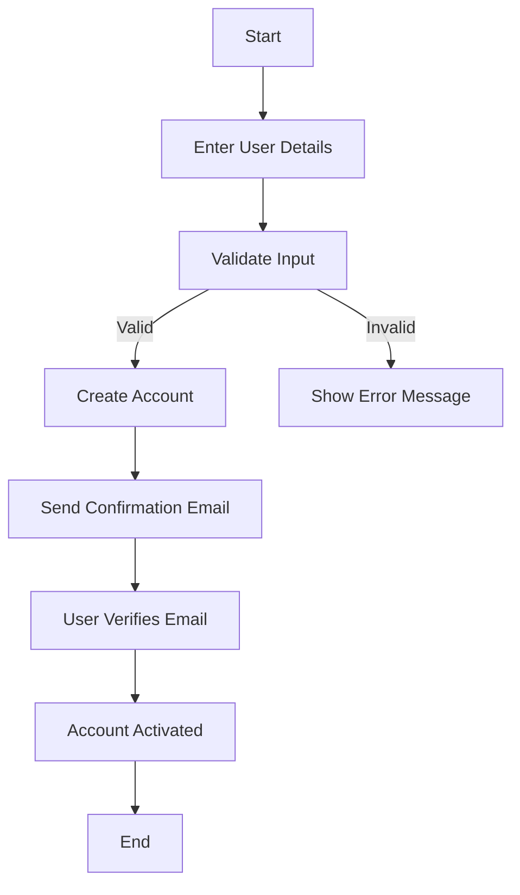
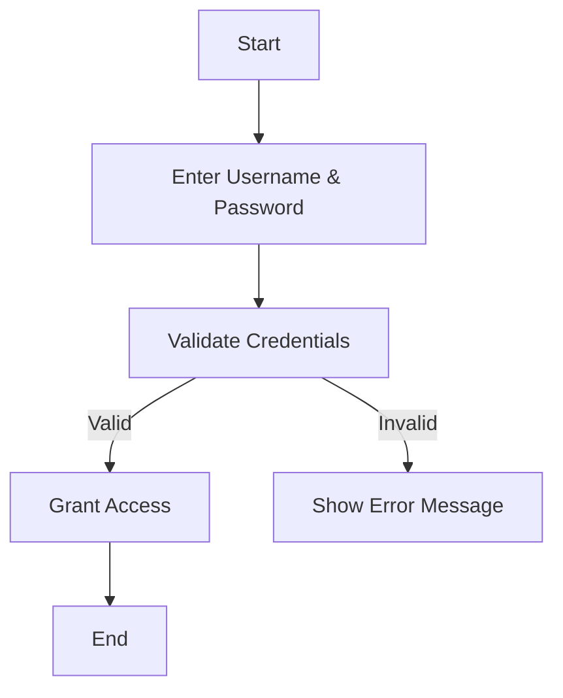
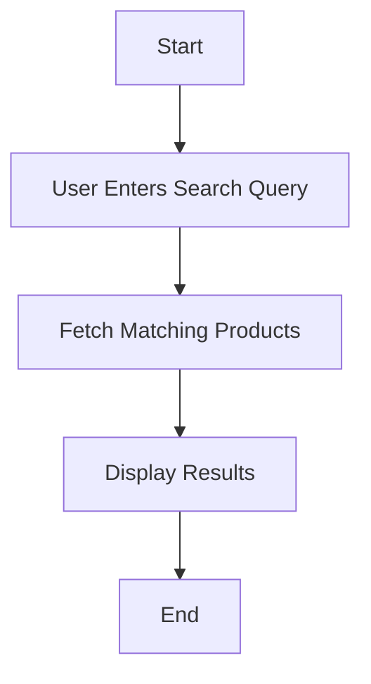
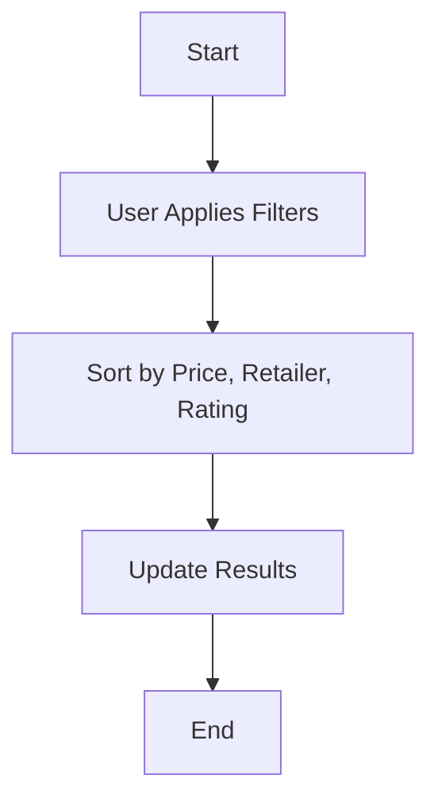
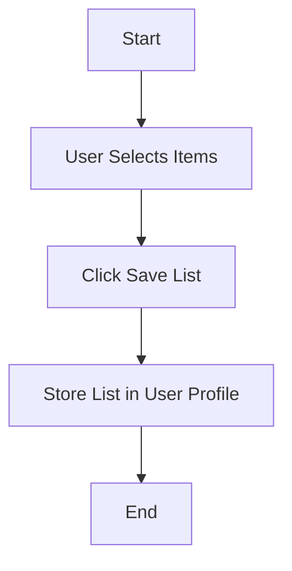
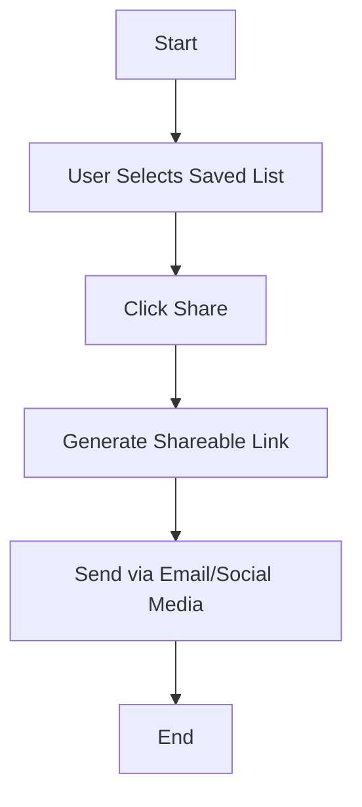
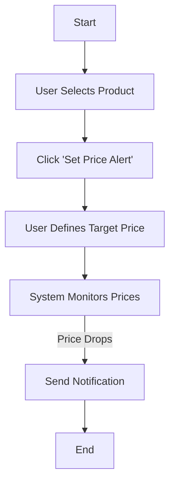
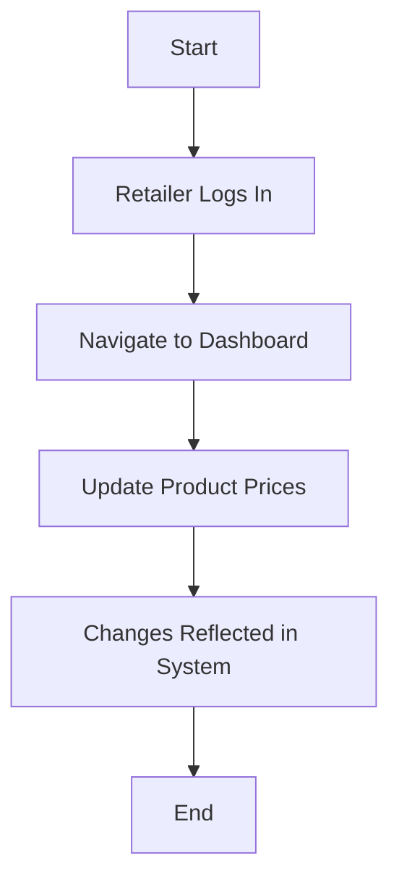

# 📌 Activity Diagrams

## 🎯 Objective
This document presents UML activity diagrams for key workflows in the system. Each workflow is designed to enhance system efficiency, user experience, and stakeholder satisfaction.

✅ User Registration – Creating an account.
✅ User Login & Authentication – Secure access.
✅ Search for a Product – Finding grocery items.
✅ Filter & Sort Prices – Customizing search results.
✅ Save a Shopping List – Organizing favorite items.
✅ Share a Shopping List – Sending lists to others.
✅ Set Price Alerts – Notifying users of price drops.
✅ Retailer Price Updates – Ensuring accurate data.

---
# Activity Workflow Modeling

## 1. User Registration

### Explanation:
- Ensures users enter valid information before creating an account.
- Confirmation email step adds security and prevents fake accounts.

---

## 2. User Login & Authentication

### Explanation:
- Basic authentication ensures secure access.
- Error handling prevents unauthorized access.

---

## 3. Search for a Product

### Explanation:
- Ensures users can find items efficiently.
- Fetches data dynamically for real-time updates.

---

## 4. Filter & Sort Prices

### Explanation:
- Enhances usability by allowing filtering options.
- Sorting improves decision-making.

---

## 5. Save a Shopping List

### Explanation:
- Allows users to track preferred products.
- Saves data for future reference.

---

## 6. Share a Shopping List

### Explanation:
- Helps users collaborate on grocery shopping.
- Shareable links make distribution seamless.

---

## 7. Set Price Alerts

### Explanation:
- Helps users get notified of deals.
- Automates price tracking for convenience.

---

## 8. Retailer Price Updates

### Explanation:
- Ensures accurate price updates from retailers.
- Keeps system data fresh and relevant.

---

These workflows align with the system’s functional requirements and use cases by ensuring **smooth user interactions, real-time updates, and a seamless shopping experience**.

---