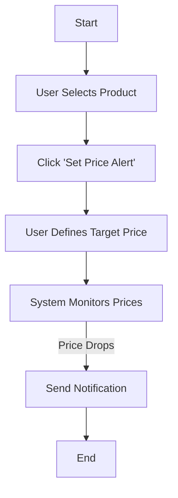

# 📌 Set Price Alerts

### Explanation:
- Helps users get notified of deals.
- Automates price tracking for convenience.

---
* [Back to Activity Diagrams overview](Activity%20Diagrams.md)
* [Back to README.md](../../../README.md)