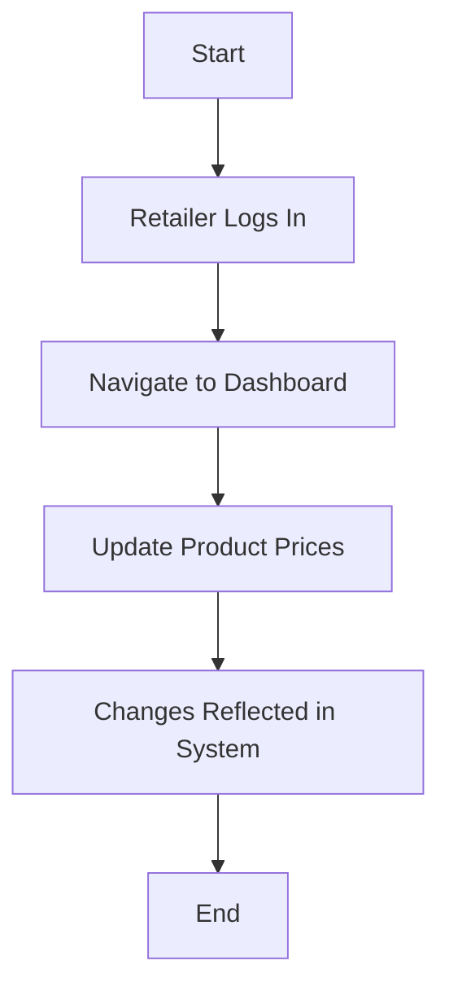

# 📌 Retailer Price Updates

```mermaid
graph TD;
    A[Start] --> B[Retailer Logs In];
    B --> C[Navigate to Dashboard];
    C --> D[Update Product Prices];
    D --> E[Changes Reflected in System];
    E --> F[End];
```

### Explanation:
- Ensures accurate price updates from retailers.
- Keeps system data fresh and relevant.

---

[Back to README.md](../../../README.md)