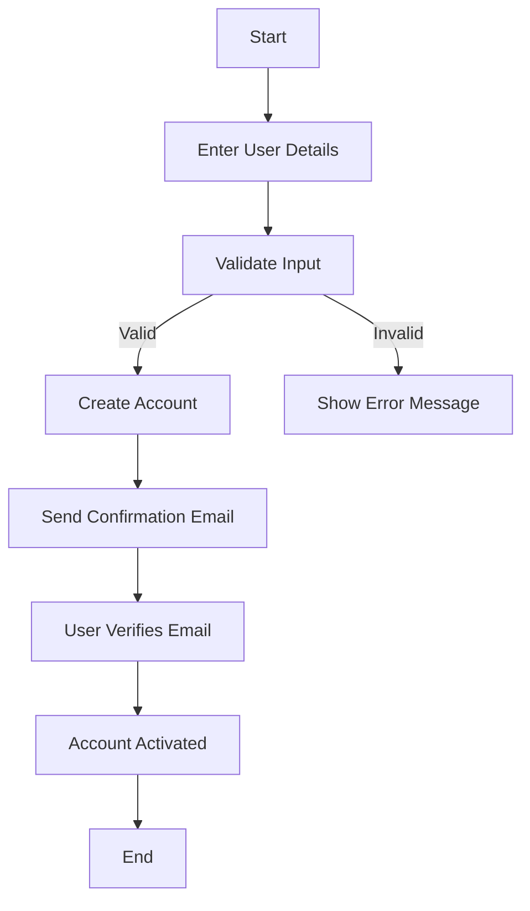
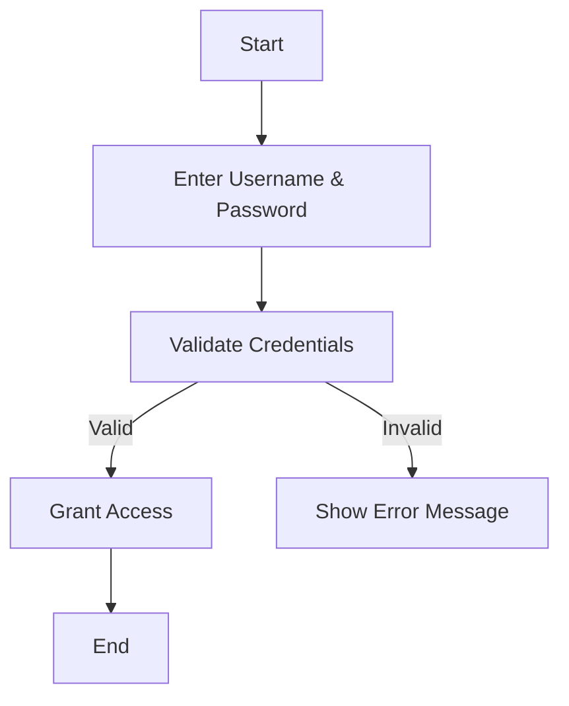
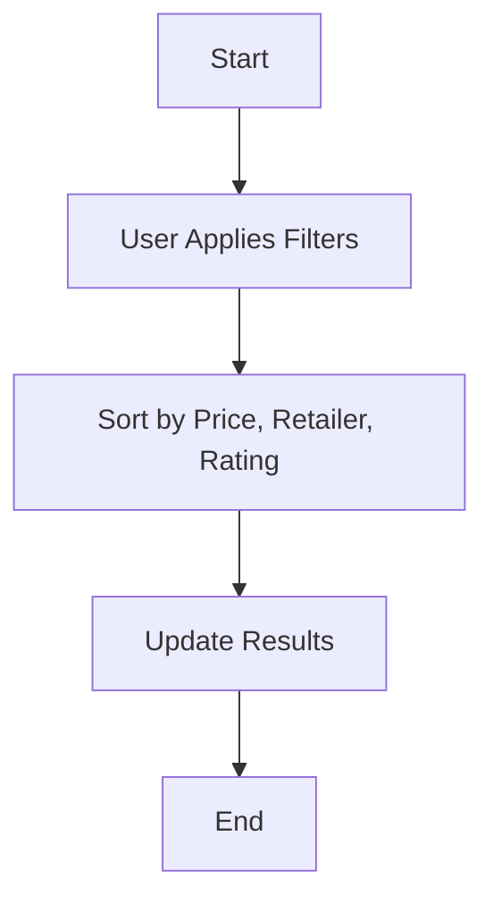
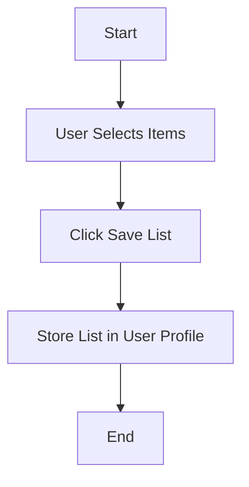
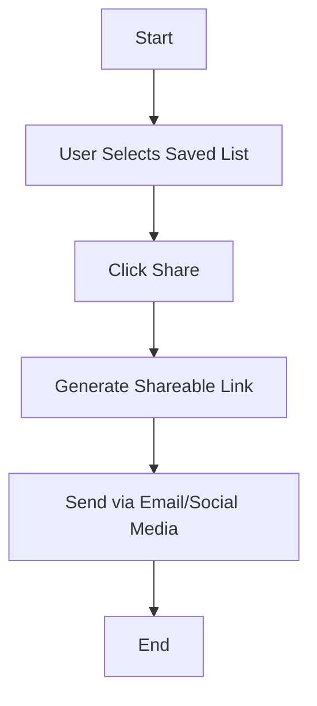

### 📌 User Registration

### Explanation:
- Ensures users enter valid information before creating an account.
- Confirmation email step adds security and prevents fake accounts.

---

### 📌 User Login & Authentication

### Explanation:
- Basic authentication ensures secure access.
- Error handling prevents unauthorized access.

---

### 📌 Filter & Sort Prices

### Explanation:
- Enhances usability by allowing filtering options.
- Sorting improves decision-making.

---

### 📌 Save a Shopping List

### Explanation:
- Allows users to track preferred products.
- Saves data for future reference.

---

### 📌 Share a Shopping List

### Explanation:
- Helps users collaborate on grocery shopping.
- Shareable links make distribution seamless.

---

[Back to README.md](../../../README.md)