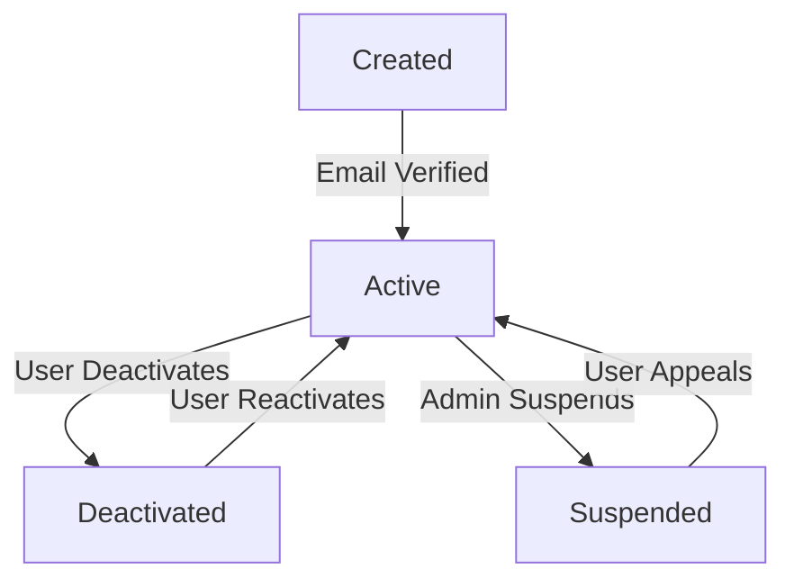
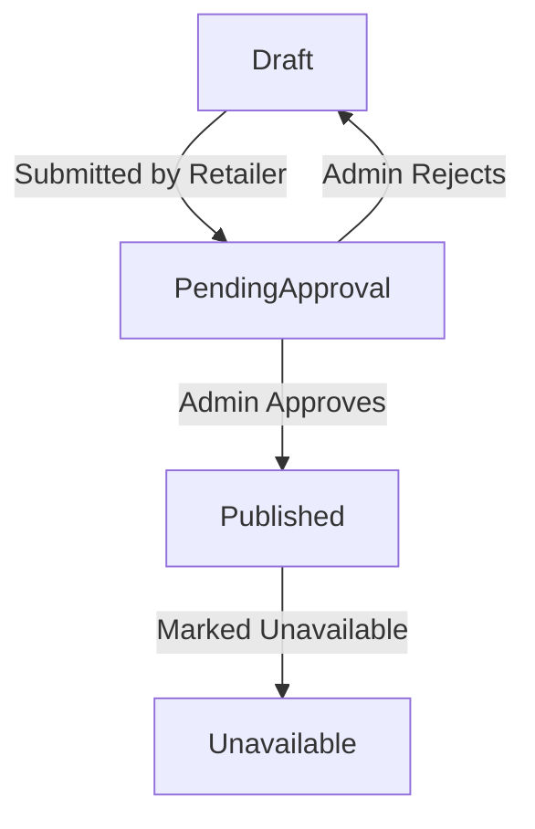
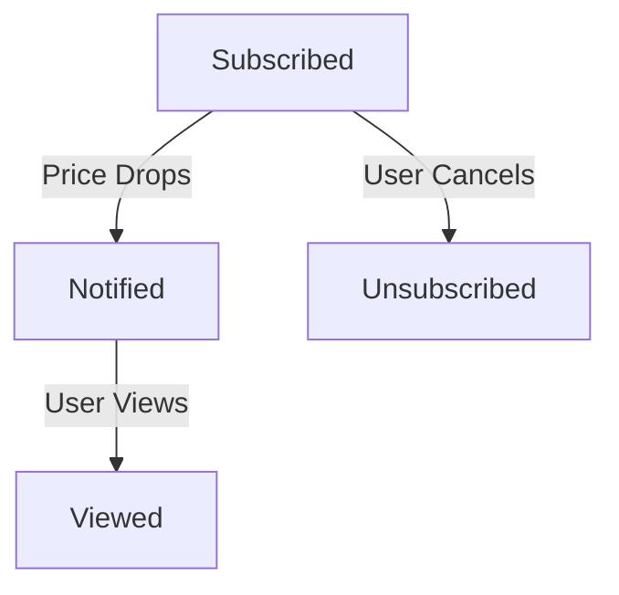
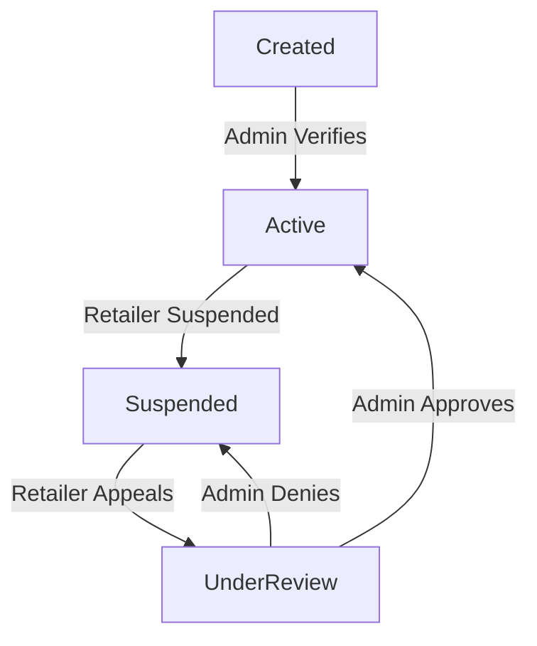
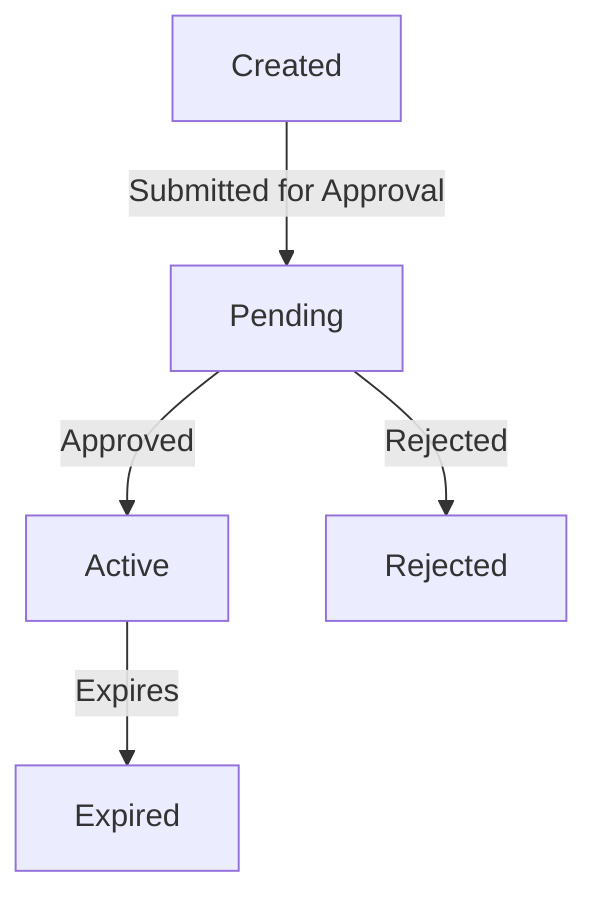
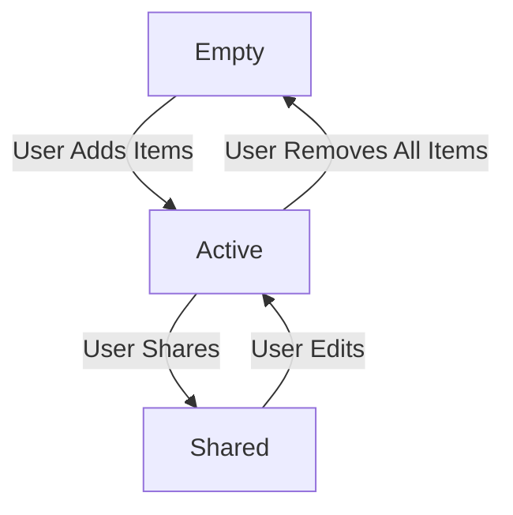
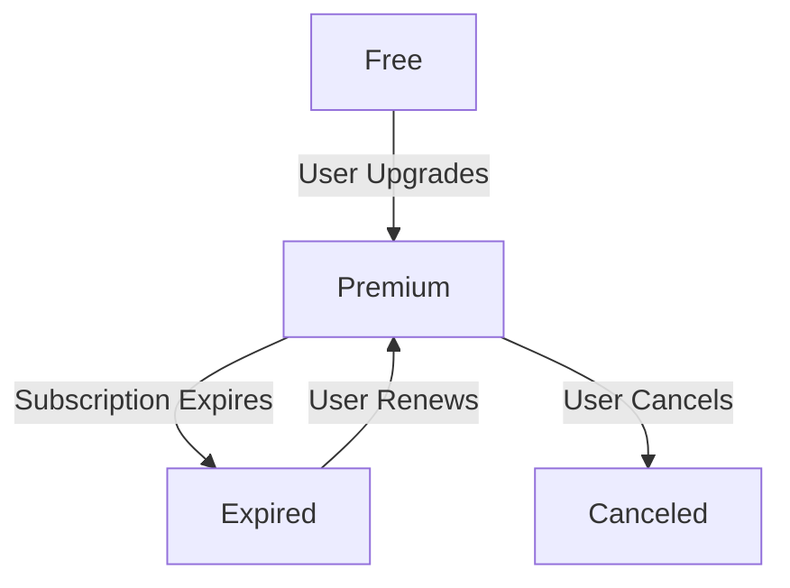
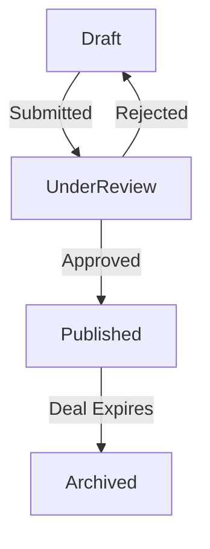

# 📌 State Transition Diagrams

## Objective
Model the dynamic behavior of your grocery price aggregator application using state transition diagrams (object state modeling). These diagrams refine the system's interactions and prepare the application for detailed design and implementation.

---

### 🎯 Case: Price aggregator comparison system

---

## 🔑 Critical Objects Identified:
1. [User Account](user_account.md)
2. [Product](product.md)
3. [Price Alert](price_alert.md)
4. [Retailer Profile](retailer_profile.md)
5. [Promotion](user_account.md)
6. [Saved List](user_account.md)
7. [Subscription](user_account.md)
8. [Retailer Deal Submission](user_account.md)

---

### 1. **User Account**

**Explanation:**
- **Key states:** Created, Active, Suspended, Deactivated
- **Transitions:** Email verification activates account; account can be suspended or deactivated by user or admin
- **Mapping to Functional Requirements:** FR-001 (Account management and access control)

---

### 2. **Product**

**Explanation:**
- **Key states:** Draft, PendingApproval, Published, Unavailable
- **Transitions:** Retailers submit products for approval before they're shown publicly
- **Mapping to Functional Requirements:** FR-002 (Content moderation and product availability)

---

### 3. **Price Alert**

**Explanation:**
- **Key states:** Subscribed, Notified, Viewed, Unsubscribed
- **Transitions:** Triggered by changes in product price or user actions
- **Mapping to Functional Requirements:** FR-003 (Personalized user alerts)

---

### 4. **Retailer Profile**

**Explanation:**
- **Key states:** Created, Active, Suspended, UnderReview
- **Transitions:** Controlled by admin moderation and appeal processes
- **Mapping to Functional Requirements:** FR-004 (Retailer access and visibility)

---

### 5. **Promotion**

**Explanation:**
- **Key states:** Created, Pending, Active, Rejected, Expired
- **Transitions:** Tied to campaign lifecycle and approval system
- **Mapping to Functional Requirements:** FR-005 (Promotion and deal lifecycle)

---

### 6. **Saved List**

**Explanation:**
- **Key states:** Empty, Active, Shared
- **Transitions:** Users manage and share product collections
- **Mapping to Functional Requirements:** FR-006 (List creation and sharing for user convenience)

---

### 7. **Subscription**

**Explanation:**
- **Key states:** Free, Premium, Expired, Canceled
- **Transitions:** Managed by user actions and system triggers
- **Mapping to Functional Requirements:** FR-007 (Subscription management and renewal process)

---

### 8. **Retailer Deal Submission**

**Explanation:**
- **Key states:** Draft, UnderReview, Published, Archived
- **Transitions:** Admin oversight ensures quality and current info
- **Mapping to Functional Requirements:** FR-008 (Retailer submissions and updates to deals)

---
