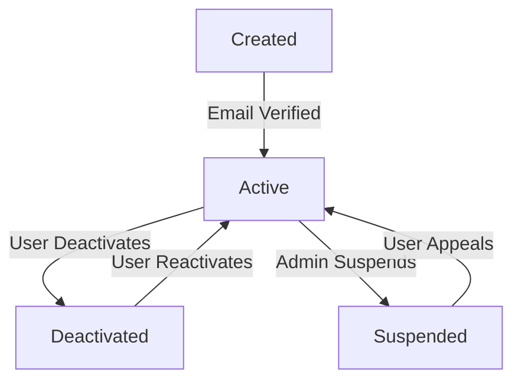
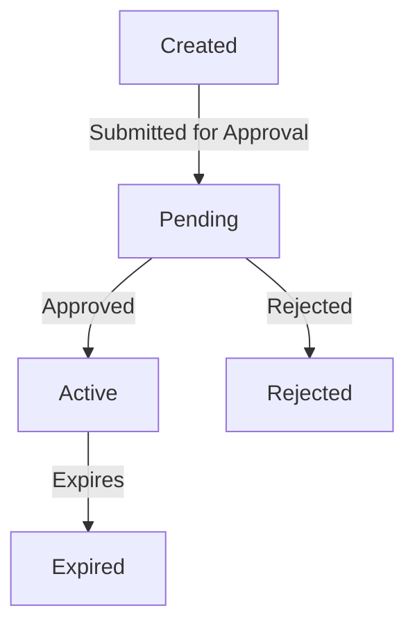
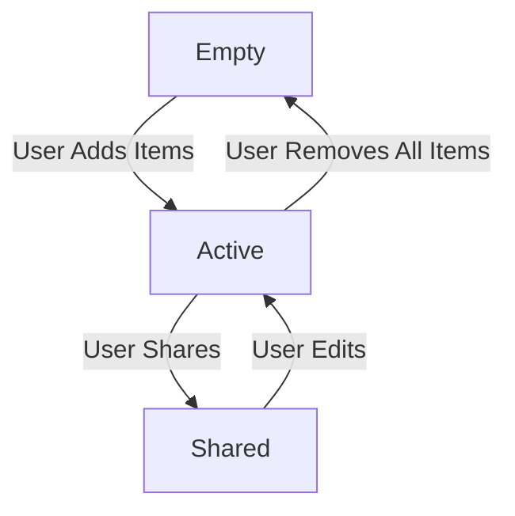
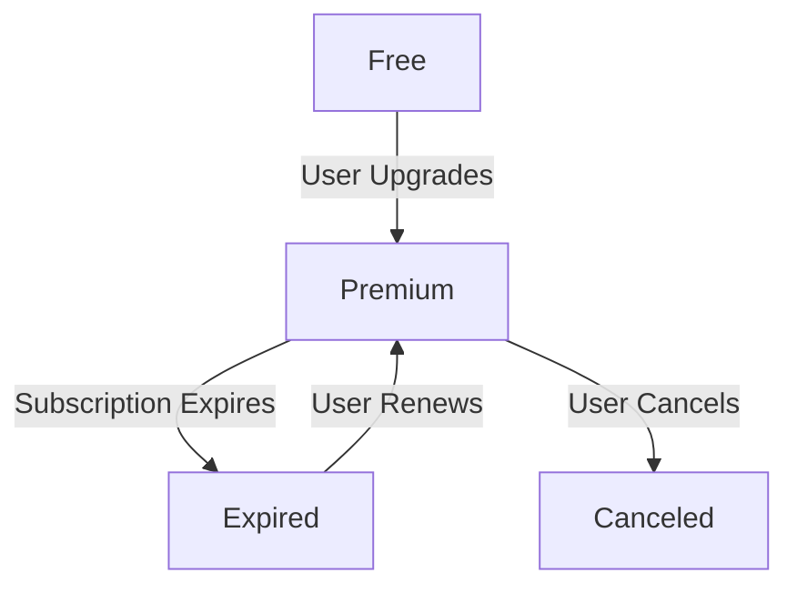
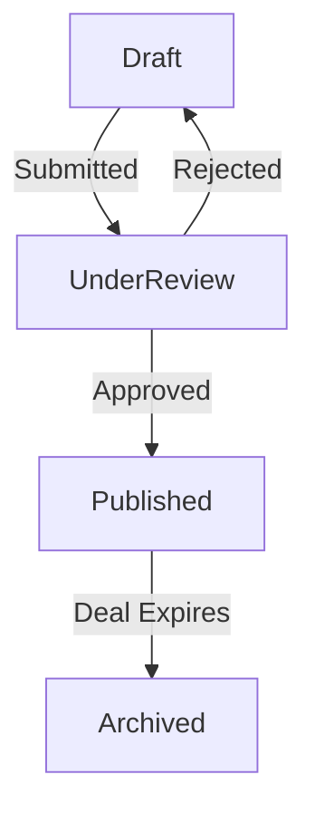

### 📌 User Account

**Explanation:**
- **Key states:** Created, Active, Suspended, Deactivated
- **Transitions:** Email verification activates account; account can be suspended or deactivated by user or admin
- **Mapping to Functional Requirements:** FR-001 (Account management and access control)

---

### 📌 Promotion

**Explanation:**
- **Key states:** Created, Pending, Active, Rejected, Expired
- **Transitions:** Tied to campaign lifecycle and approval system
- **Mapping to Functional Requirements:** FR-005 (Promotion and deal lifecycle)

---

### 📌 Saved List

**Explanation:**
- **Key states:** Empty, Active, Shared
- **Transitions:** Users manage and share product collections
- **Mapping to Functional Requirements:** FR-006 (List creation and sharing for user convenience)

---

### 📌 Subscription

**Explanation:**
- **Key states:** Free, Premium, Expired, Canceled
- **Transitions:** Managed by user actions and system triggers
- **Mapping to Functional Requirements:** FR-007 (Subscription management and renewal process)

---

### 📌 Retailer Deal Submission

**Explanation:**
- **Key states:** Draft, UnderReview, Published, Archived
- **Transitions:** Admin oversight ensures quality and current info
- **Mapping to Functional Requirements:** FR-008 (Retailer submissions and updates to deals)

---
* [Back to State Transition Diagrams](../../State%20Transition%20Diagrams.md)
* [Back to README](../../../README.md)