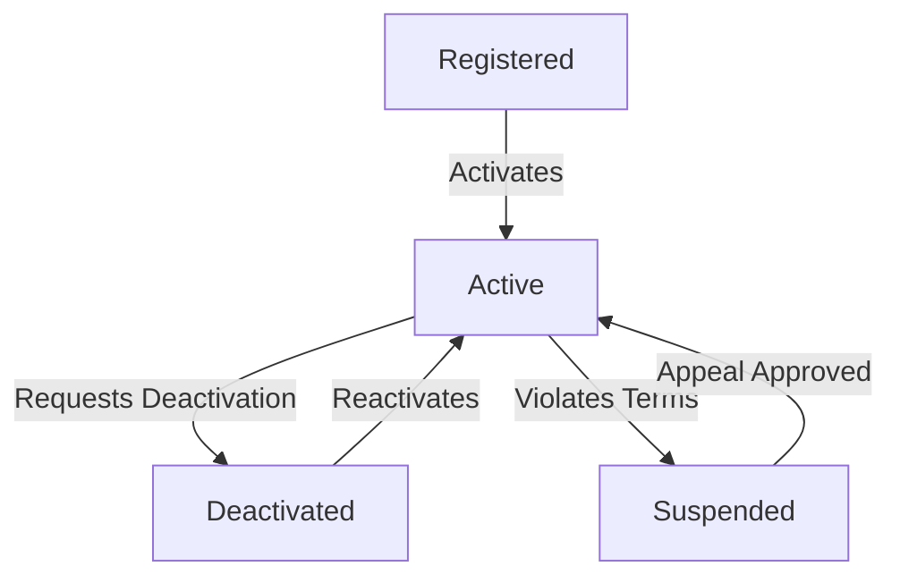
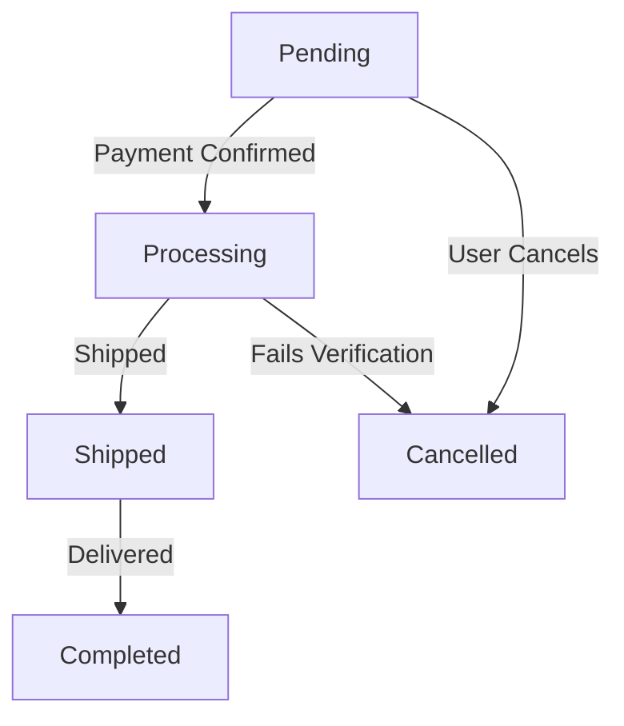
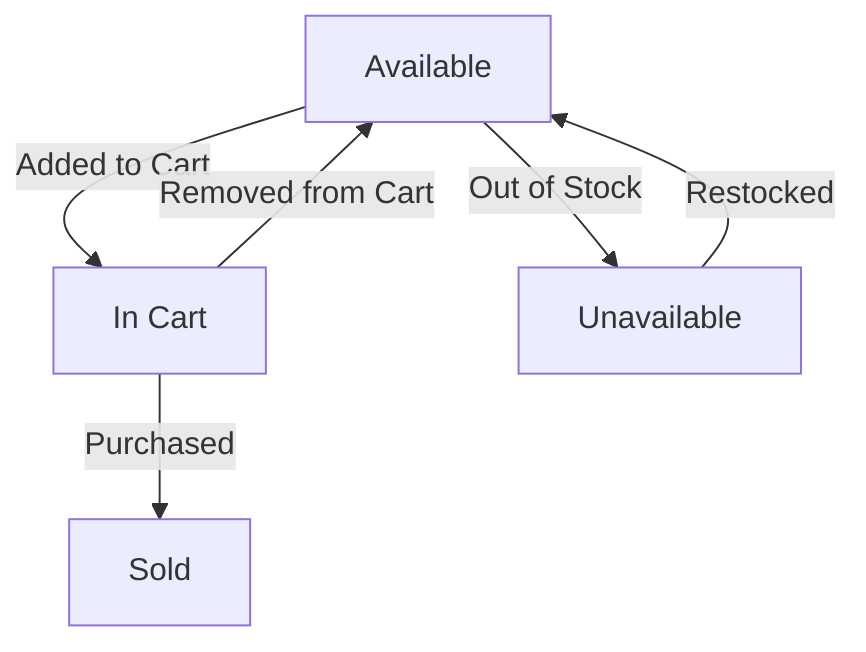
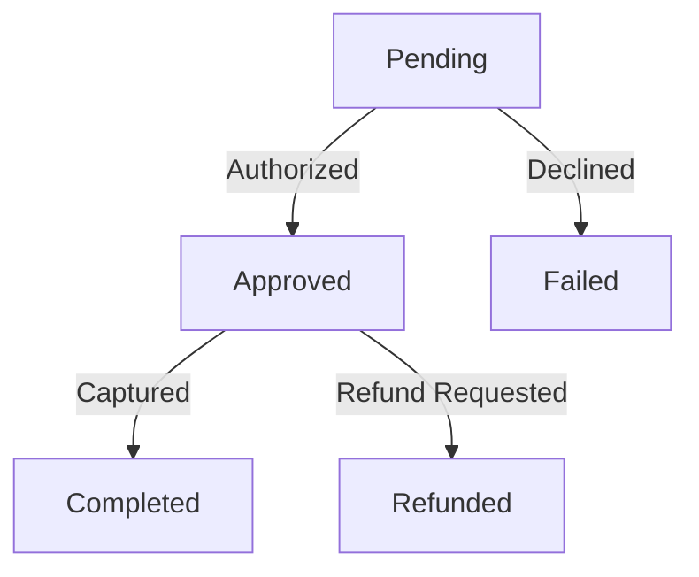
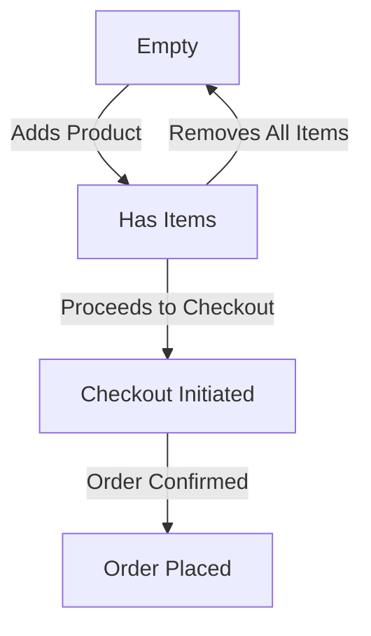
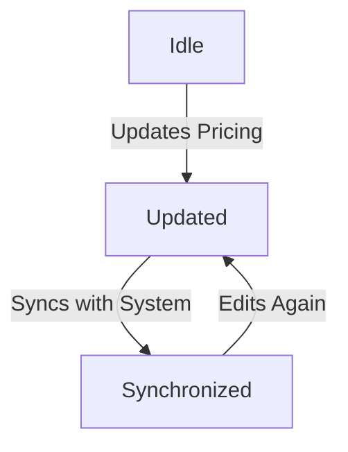
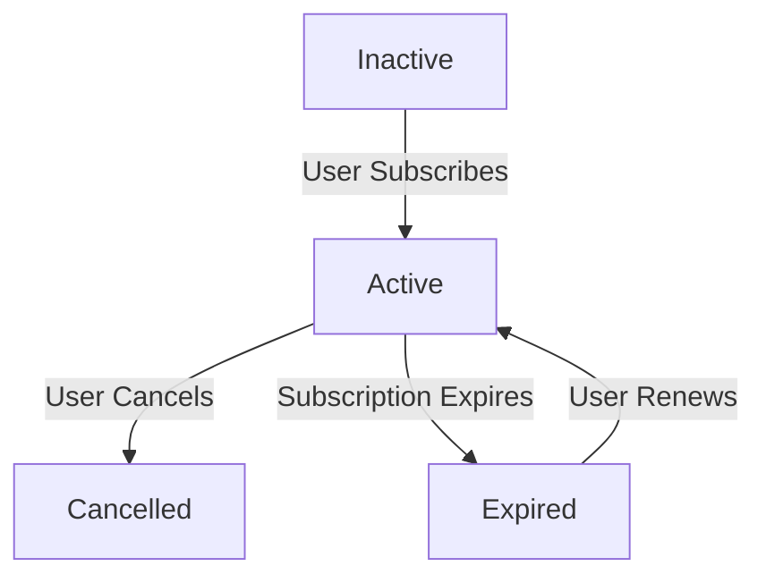
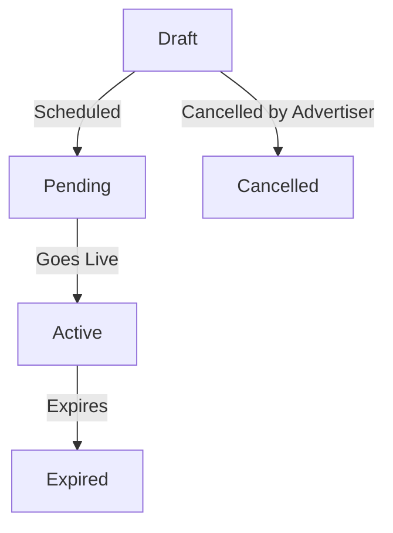

# Object State Modeling and Activity Workflow Modeling

## 📌 Objective
Model the dynamic behavior of the system using state transition diagrams and activity diagrams. These diagrams refine the system's interactions and prepare the application for detailed design and implementation.

## 🎯 Scenario
Building on Agile planning (Assignment 6) and Kanban workflow (Assignment 7), the focus here is to:
1. Define object lifecycles (e.g., how a "Book" object transitions from "Available" to "Checked Out").
2. Map activity workflows (e.g., the steps in a "Checkout Book" process).
3. Ensure alignment with functional requirements (Assignment 4) and use cases (Assignment 5).

---

## 🔑 Critical Objects
The following critical objects have been identified:
1. **User Account**
2. **Order**
3. **Product**
4. **Payment**
5. **Cart**
6. **Retailer Dashboard**
7. **Subscription**
8. **Promotion**

---

## 🔄 State Transition Diagrams

### 1️⃣ User Account

### Explanation:
- **Registered**: When a user creates an account.
- **Active**: When the user activates their account.
- **Deactivated**: User-initiated deactivation.
- **Suspended**: Account violation leads to suspension.
- **Reactivation** possible from Deactivated or Suspended states.

---

### 2️⃣ Order

### Explanation:
- **Pending**: Initial state after order placement.
- **Processing**: Order is verified and prepared for shipment.
- **Shipped**: Order has been sent out.
- **Completed**: Order successfully delivered.
- **Cancelled**: User cancels order or verification fails.

---

### 3️⃣ Product

### Explanation:
- **Available**: Product is in stock.
- **In Cart**: Added to a user's cart.
- **Sold**: Purchased successfully.
- **Unavailable**: Stock runs out.
- **Restocked**: Returns to Available when inventory is updated.

---

### 4️⃣ Payment

### Explanation:
- **Pending**: Awaiting authorization.
- **Approved**: Successfully authorized.
- **Failed**: Payment declined.
- **Completed**: Payment fully processed.
- **Refunded**: User requests and receives a refund.

---

### 5️⃣ Cart

### Explanation:
- **Empty**: No items in the cart.
- **Has Items**: User adds items.
- **Checkout Initiated**: User starts checkout process.
- **Order Placed**: User confirms and finalizes purchase.

---

### 6️⃣ Retailer Dashboard

### Explanation:
- **Idle**: No recent updates.
- **Updated**: Retailer updates product prices.
- **Synchronized**: Pricing updates reflect in the system.

---

### 7️⃣ Subscription

### Explanation:
- **Inactive**: Not subscribed.
- **Active**: User subscribes successfully.
- **Cancelled**: User cancels their subscription.
- **Expired**: Subscription period ends.
- **Renewal** moves it back to Active.

---

### 8️⃣ Promotion

### Explanation:
- **Draft**: Promotion is being created.
- **Pending**: Scheduled for future activation.
- **Active**: Promotion is live.
- **Expired**: Promotion duration ends.
- **Cancelled**: Advertiser cancels before going live.

---

## 📝 Summary
These state transition diagrams capture how key objects move through different states within the system. They ensure alignment with:
- Functional requirements (Assignment 4)
- Use cases (Assignment 5)
- Agile workflows (Assignment 6 & 7)

Each diagram aids in understanding how data flows through the system and contributes to better system design and implementation.

---

✅ **Next Steps**: Develop corresponding activity diagrams for workflow modeling. 🚀
