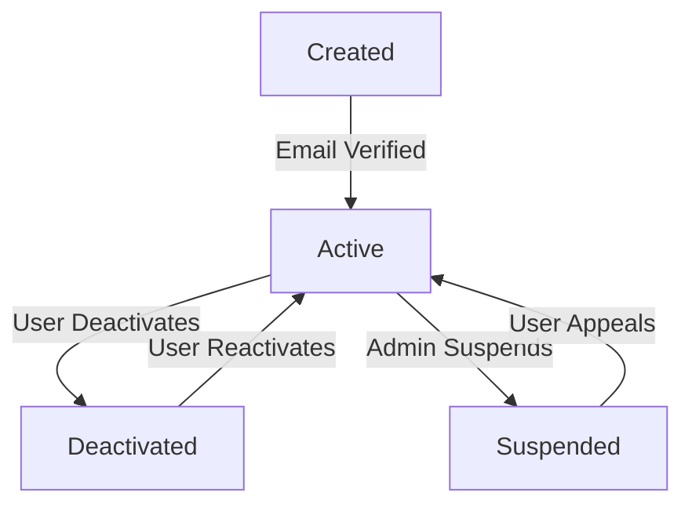
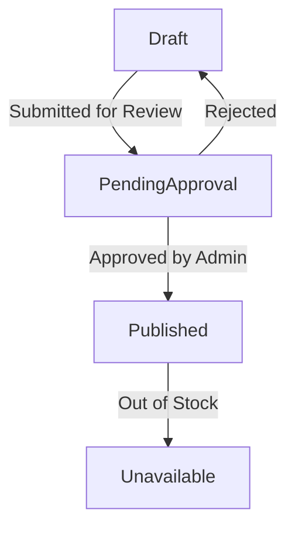
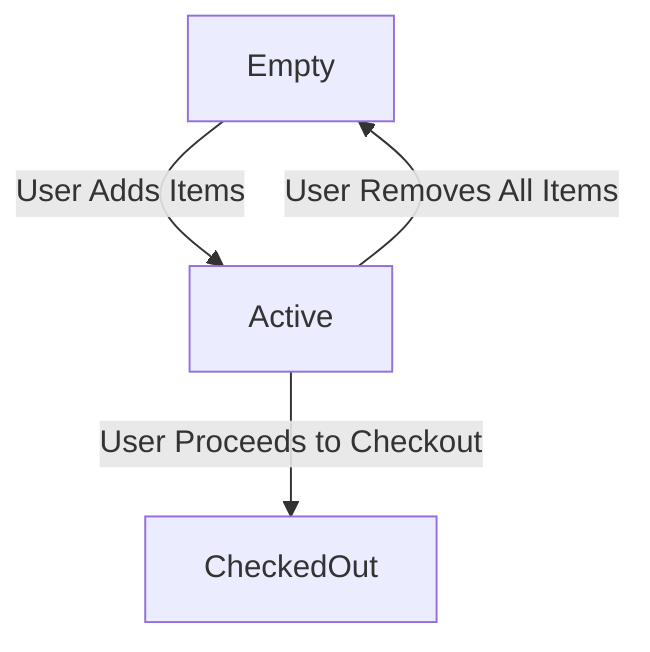
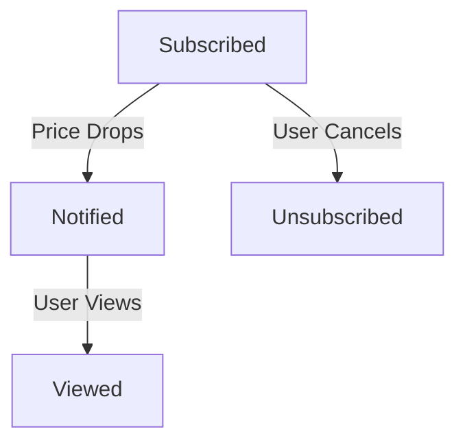
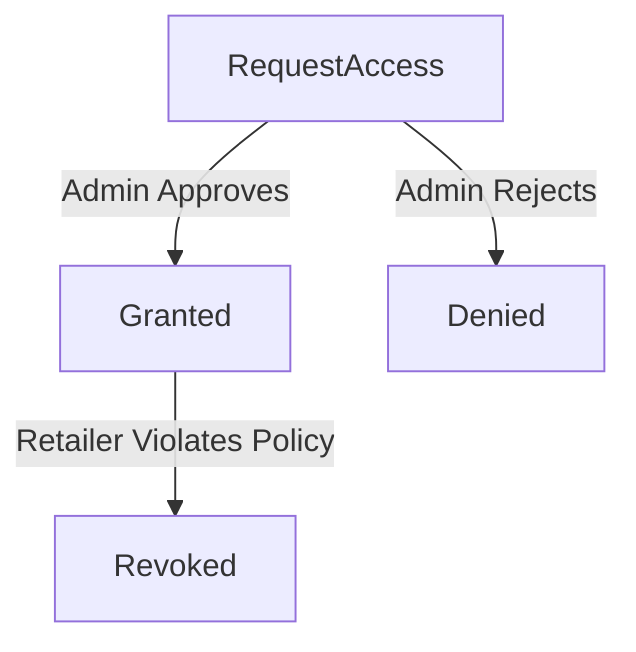
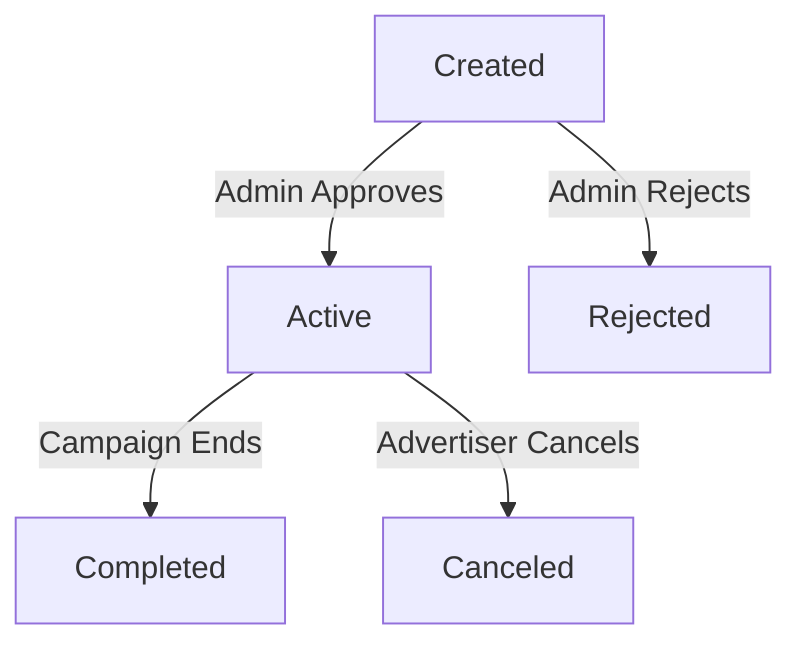

# 📌 State Transition Diagrams

## Objective

Model the dynamic behavior of your system using state transition diagrams (object state
modeling) and activity diagrams (workflow modeling). These diagrams refine the system's interactions and prepare the application for detailed design and implementation.

## 🎯 Scenario
Building on Agile planning and Kanban workflow, the focus here is to:
1. Define object lifecycles 
2. Map activity workflows
3. Ensure alignment with functional requirements and use cases.

---

## 🔑 Critical Objects
The following critical objects have been identified:

1. User Account
2. Product
3. Price Alert
4. Retailer Dashboard Access
5. Advertisement Campaign
6. Saved List (New: Replaces Cart)

    Subscription

    Promotion

---
# 📌 State Transition Diagrams

## Objective
Model the dynamic behavior of your system using state transition diagrams (object state modeling) and activity diagrams (workflow modeling). These diagrams refine the system's interactions and prepare the application for detailed design and implementation.

## 🎯 Scenario
Building on Agile planning and Kanban workflow, the focus here is to:
1. Define object lifecycles
2. Map activity workflows
3. Ensure alignment with functional requirements and use cases.

---

## 🔑 Critical Objects
The following critical objects have been identified:
1. **User Account**
2. **Product**
3. **Cart**
4. **Price Alert**
5. **Retailer Dashboard Access**
6. **Advertisement Campaign**

---

### 1. **User Account**

#### Explanation:
- **Key states**: Created, Active, Suspended, Deactivated.
- **Transitions**: Account is created, verified, activated, can be suspended or deactivated.
- **Mapping to Functional Requirements**: FR-001 (User account creation and management).

---

### 2. **Product**

#### Explanation:
- **Key states**: Draft, PendingApproval, Published, Unavailable.
- **Mapping to Functional Requirements**: FR-002 (Product management and approval process).

---

### 3. **Cart**

#### Explanation:
- **Key states**: Empty, Active, CheckedOut.
- **Mapping to Functional Requirements**: FR-003 (Cart functionality and user list management).

---

### 4. **Price Alert**

#### Explanation:
- **Key states**: Subscribed, Notified, Viewed, Unsubscribed.
- **Mapping to Functional Requirements**: FR-004 (User notifications for price drops).

---

### 5. **Retailer Dashboard Access**

#### Explanation:
- **Key states**: RequestAccess, Granted, Denied, Revoked.
- **Mapping to Functional Requirements**: FR-005 (Retailer access control and policies).

---

### 6. **Advertisement Campaign**

#### Explanation:
- **Key states**: Created, Active, Completed, Rejected, Canceled.
- **Mapping to Functional Requirements**: FR-006 (Advertisement management and status tracking).

---
