```mermaid
graph TD;
  %% Define Actors
  User["🧑‍💻 User"] 
  Retailer["🏪 Retailer"]
  Admin["🛠️ Admin"]
  DataProvider["🔗 Data Provider"]
  Advertiser["📢 Advertiser"]
  
  %% Define Use Cases
  A["Search for Products"]
  B["Compare Prices"]
  C["Apply Filters"]
  D["View Product Details"]
  E["Receive Price Drop Alerts"]
  F["Update Pricing"]
  G["Manage System Data"]
  H["Publish Promotions"]
  I["Subscribe to Notifications"]
  J["View Promotions"]
  K["Manage User Accounts"]
  
  %% Relationships
  User --> A
  User --> B
  User --> C
  User --> D
  User --> E
  User --> I
  User --> J

  Retailer --> F
  Retailer --> H

  Admin --> G
  Admin --> K

  DataProvider -->|Provides Data| F
  Advertiser -->|Posts Promotions| H

  %% Use Case Relationships
  B -->|includes| A
  E -->|includes| I
  C -->|extends| A
  H -->|extends| F
```

# 📌 Use Case Diagram

---
### 🎯 Use Case: Price aggregator comparison system

---
## Overview

This document presents the Use Case Diagram for the Price Aggregator Comparison System, outlining the key system interactions and stakeholders. It visualizes the roles and relationships of actors (User, Retailer, Admin, Data Provider, Advertiser) with various system use cases, such as searching for products, comparing prices, applying filters, and subscribing to notifications.

The Actors & Roles section defines the specific responsibilities of each role, while the Relationships section explains generalizations, inclusions, and extensions between use cases, demonstrating how actions like price comparison and notifications build upon other core functionalities.

Finally, the Addressing Stakeholder Concerns section highlights how the system addresses the needs of users, retailers, admins, data providers, and advertisers to ensure seamless interaction, data accuracy, and effective promotions. This diagram provides a clear structure for understanding user-system interactions and ensures stakeholder requirements are effectively met.

---

---
### Actors & Roles
- **User**: Searches for products, compares prices, applies filters, views product details, and subscribes to price alerts. A login option is provided to personalize the experience.
- **Retailer**: Updates pricing and publishes promotional items to attract customers.
- **Admin**: Manages system data, user accounts, and ensures data integrity.
- **Data Provider**: Supplies pricing data to the system via APIs or manual uploads.
- **Advertiser**: Publishes promotional deals, which are displayed to users via the system.
---
### Relationships

**Generalization**
- Admin is a specialized role that extends system management functions.
- Both Retailers and Advertisers interact with the system but in different ways.

**Inclusion**
- “Compare Prices” ⟶ (includes) ⟶ “Search for Products”
- “Receive Price Drop Alerts” ⟶ (includes) ⟶ “Subscribe to Notifications”

**Extension**
- “Apply Filters” ⟶ (extends) ⟶ “Search for Products”
- “Publish Promotions” ⟶ (extends) ⟶ “Update Pricing”
---
### Addressing Stakeholder Concerns
- **Users**: The system provides an intuitive interface with efficient search, comparison tools, and personalized alerts to enhance their experience.
- **Retailers**: The system supports direct data integration via APIs or manual uploads, ensuring accurate and timely updates.
- **Admins**: Role-based access control (RBAC) and monitoring tools are implemented to maintain data integrity and system performance.
- **Data Providers**: The system integrates APIs and web scraping mechanisms to ensure seamless data collection.
- **Advertisers**: The system highlights promotional deals through notifications and banners, ensuring maximum visibility.
---

[Back to Test and Use Case Document.md](Test%20and%20Use%20Case%20Document.md)