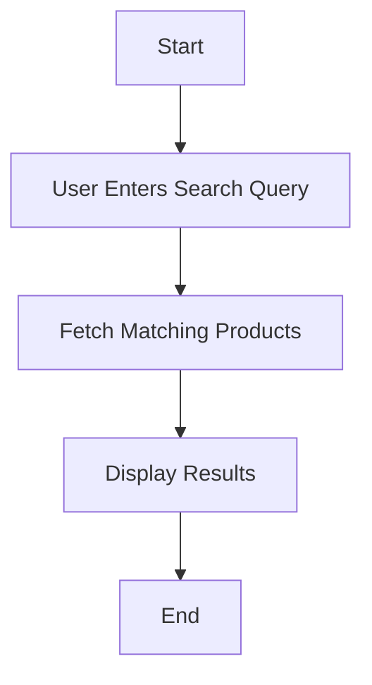

# 📌 Search for a Product

```mermaid
graph TD;
    A[Start] --> B[User Enters Search Query];
    B --> C[Fetch Matching Products];
    C --> D[Display Results];
    D --> E[End];
```

### Explanation:
- Ensures users can find items efficiently.
- Fetches data dynamically for real-time updates.

---

[Back to README.md](../../../README.md)