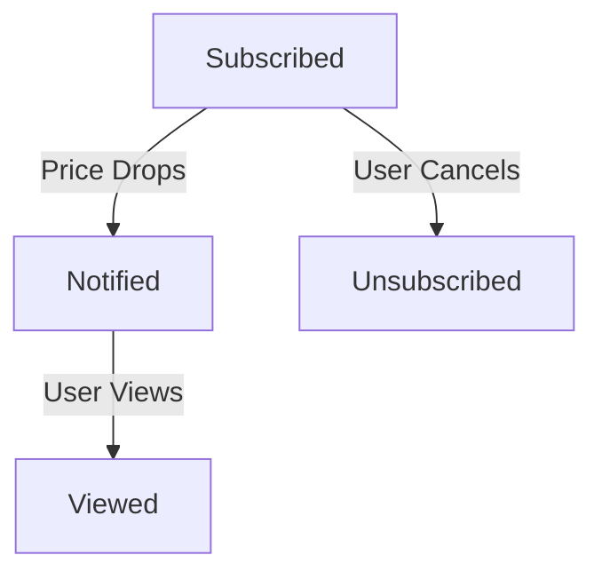

### 📌 Price Alert

**Explanation:**
- **Key states:** Subscribed, Notified, Viewed, Unsubscribed
- **Transitions:** Triggered by changes in product price or user actions
- **Mapping to Functional Requirements:** FR-003 (Personalized user alerts)

---
* [Back to State Transition Diagrams](../../State%20Transition%20Diagrams.md)
* [Back to README](../../../README.md)