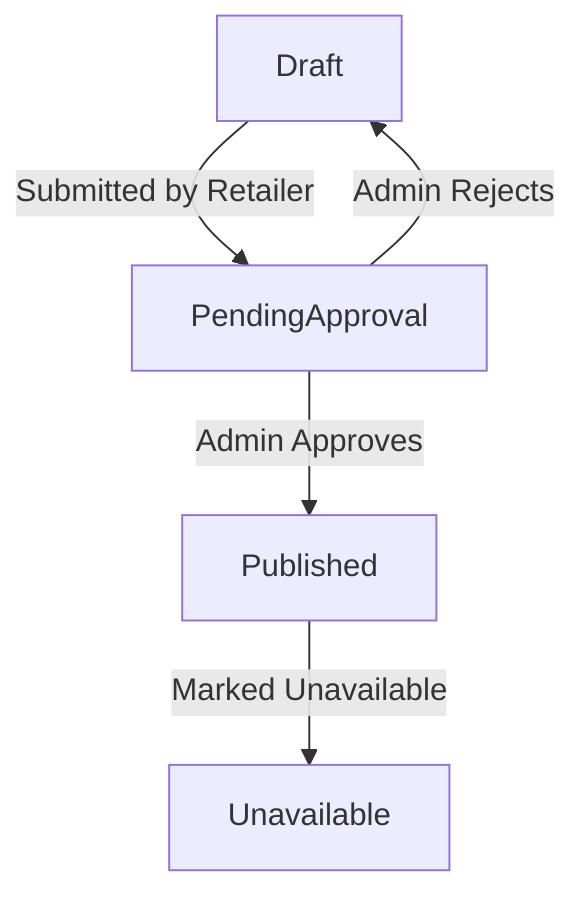

### 📌 Product

**Explanation:**
- **Key states:** Draft, PendingApproval, Published, Unavailable
- **Transitions:** Retailers submit products for approval before they're shown publicly
- **Mapping to Functional Requirements:** FR-002 (Content moderation and product availability)

---
* [Back to State Transition Diagrams](../../State%20Transition%20Diagrams.md)
* [Back to README](../../../README.md)