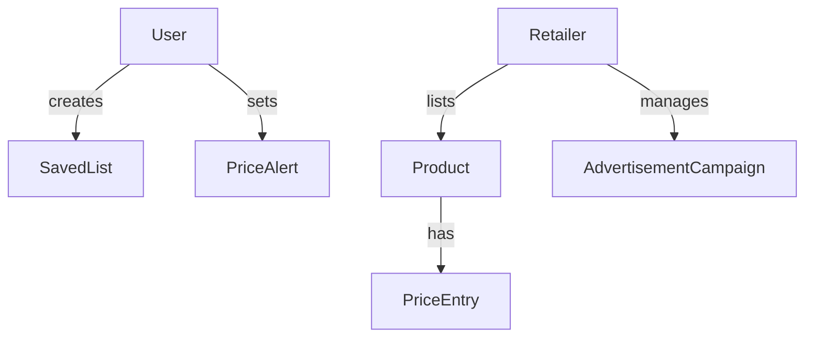

# 🧩 Domain Model

---

### 🎯 Case: Price aggregator comparison system

---

## Objective

This document presents a detailed domain model for the Grocery Price Aggregator app. It defines the core entities, their attributes and responsibilities, relationships, and business rules aligned with previous assignments (requirements, user stories, use cases, state/activity diagrams).

---

## 🏗️ Domain Architecture

### Core Entities
- **User Management**: User, SavedList, PriceAlert
- **Product Catalog**: Product, Promotion
- **Retailer Management**: Retailer, AdvertisementCampaign
- **Pricing System**: PriceEntry

### Domain Relationships

### 📋 Entity Specifications
#### 1. User

Attributes: userId, name, email, password, status
Responsibilities: Authentication, profile management, alert management
Business Rules:

- Maximum 10 active price alerts per user

- Email verification required for activation

- Profile updates require re-authentication

#### 2. Product

Attributes: productId, name, price, description, category, status
Responsibilities: Price comparison, retailer association
Business Rules:

- Products require retailer association

- Price history maintained for 90 days

- Products can be in multiple categories

#### 3. PriceAlert

Attributes: alertId, userId, productId, targetPrice, isActive
Responsibilities: Price monitoring, user notification
Business Rules:

- Alerts trigger when price ≤ targetPrice

- Users receive maximum 3 notifications per alert

- Alerts expire after 30 days of inactivity

#### 4. Retailer

Attributes: retailerId, name, location, status, verificationStatus
Responsibilities: Product management, price updates, campaign management
Business Rules:

- Retailers must be verified to list products

- Price updates require authentication

- Suspended retailers cannot modify listings

#### 5. **PriceEntry**

| Attribute | Type | Description |
|-----------|------|-------------|
| entryID | String | Unique ID for the price record |
| price | Float | Price of the product |
| productID | String | FK - Related product |
| retailerID | String | FK - Retailer who listed it |
| dateListed | Date | Timestamp of price entry |

**Responsibilities (Methods):**
- `updatePrice()`
- `trackChanges()`

#### 6. SavedList
Attribute	Type	Description
listID	String	Unique list ID
userID	String	FK - List owner
name	String	List name (e.g., "Weekly Groceries")

Responsibilities (Methods):

- addProduct()

- removeProduct()

- shareList()

#### 7. AdvertisementCampaign
Attribute	Type	Description
campaignID	String	Unique campaign ID
retailerID	String	FK - Associated retailer
title	String	Campaign title
status	String	Active, Rejected, Completed
endDate	Date	Expiry date of campaign

Responsibilities (Methods):

- startCampaign()

- endCampaign()

- cancelCampaign()

### 🔗 Relationships Overview

- A User can create many SavedLists

- A Retailer can post multiple Products

- A Product has many PriceEntries (from different retailers)

- A User can set PriceAlerts for Products

- A Retailer manages AdvertisementCampaigns

### 🔒 Business Rules Summary

| Rule Category | Specific Rules |
|---------------|----------------|
| User Management | Email verification, alert limits, profile validation |
| Product Management | Retailer association, price history, categorization |
| Pricing System | Real-time updates, price validation, alert triggers |
| Retailer Operations | Verification requirements, suspension handling |
### 📏 Additional Business Rules

- A User can have a maximum of 10 active PriceAlerts

- A Retailer must be active to publish Products or Campaigns

- A PriceEntry must be linked to both a valid Product and Retailer

- SavedLists are private by default but can be shared via URL

- AdvertisementCampaigns must be reviewed before activation

### 🎯 Design Principles

- Separation of Concerns: Clear entity responsibilities

- Data Integrity: Validation at entity level

- Scalability: Modular domain structure

- Maintainability: Well-defined business rules

----
---

* [View Class Diagram](class_diagram.js)
* [View Updated Class Diagram](class_diagram_updated.js)
* [View Diagram Explanation](explanation_of_the_class_diagram.md)

* [Back to README](../../README.md)
